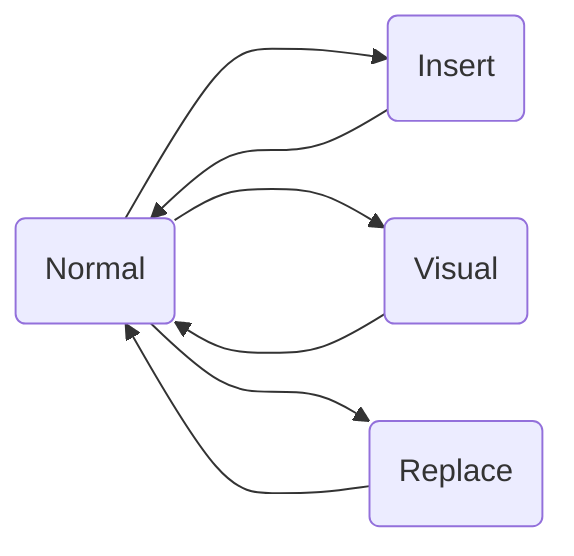

<!-- 我的vim设置 -->

# vim? 那是个什么 JB 东西？

Enjoy coding 的你，是否时常痛恨鼠标点来点去、方向键远离字母，耽误码字？可曾詈骂手动批量重复处理的痛苦？Debug 时代码上下反复跳转，令你烦闷否？别人写的编辑器设置种种不便，是否想过有一个自己私人订制的编辑器？如果你有以上苦恼，那么 vim 将是你的绝佳选择。

vim 是一个文本编辑器，素有"编辑器之神"的美名，同时它也是 Linux 尤其是服务器环境下编辑文件的主要方法。

vim 的主要特点是分模式编辑：

| 模式    | 说明      | 功能                             |
| ------- | --------- | -------------------------------- |
| Normal  | 正常      | 光标移动、阅读文件               |
| Insert  | 插入      | 在当前光标位置插入内容，编辑文件 |
| Visual  | 视觉/选择 | 选中、复制粘贴                   |
| Replace | 替换      | 替换当前光标下字符               |

其关系如下：



# 我的 vim 学习路线

不幸的是 Vim 的学习曲线确实相当陡峭，最开始你会觉得非常不适应，但一旦熬过了初始阶段，你会爱上 Vim。以我而言，现在离开了 vim 的模式几乎已经快不会写材料了，前几天交作业要求 word，我保存文件居然不是<kbd>Ctrl+s</kbd>，而是顺手来了个<kbd>:wq</kbd>。

我的 vim 学习路线如下：

- 环境：虚拟机 Ubuntu22.04 LTS 环境，vim。也可以使用 windows 下的 gvim/neovim 或 gitbash 自带 vim 等。
- 首先，阅读和观看 MIT 的`Missing Semister`中关于 vim 的[课程](https://missing.csail.mit.edu/2020/editors/)。**消失的学期其他课程也非常不错。要是我刚上大学就知道有这个学期该多好！**
- 而后，在网上玩[Vim Adventures](https://vim-adventures.com/)，多玩几遍，直到熟悉其所有键位。~~**“家贫，无从致游戏以玩”**，谁要是有这个游戏全版，记得 v 我一份！~~
- 同时，在命令行中学`vimtutor`，这是 vim 自带的基础官方教程，对于基础使用方法介绍非常完整。
  - 系统如果是中文则该教程是中文，否则为英文。
  - 使用方法为在命令行中输入<kbd>vimtutor</kbd>并回车。学习过程中尽量不要退出，因为教程不会保存本次做过的操作，下次再进来是个新的。
  - 第一次学会慢一些，一小时左右，一共 7 章若干节，一节一个技能，每一章有一个总结。
- 用了 vim，你难道不觉得键盘上的 Esc 放那么远简直是反人类吗？没错，我也这么觉得。于是想到自己做[键盘映射](https://www.qin-juan-ge-zhu.top/code/linux/keymap.html)。

想了解其他信息，可以参考 CSDiy 的[vim 指南](https://csdiy.wiki/%E5%BF%85%E5%AD%A6%E5%B7%A5%E5%85%B7/Vim/)。当然，众所周知，学习工具的核心在于使用，用起来逢山开路遇水搭桥，才最具效率和效果，_isn't it?_ 现代的我们，大多数情况的代码都有 IDE，但 vim 的分模式编辑和高度定制化一定会帮我们在 Coding 之路上快马加鞭。在你的各种 IDE 里安装 vim 插件，练起来，享受 All in One 的乐趣吧！

# vim 手动编译安装

vim 在许多 Linux 发行版都有预装，即使没有预装的也都可以下载到安装包进行安装。但是这里边有几个问题：

- 很多 vim 版本不支持 python/python2/rust/perl/lua 等语言编写的插件。
  - 是否支持某功能，在命令行运行`vim --version`或在 vim 内运行`:version`命令即可查看，带有`+`号的表示支持，`-`号表示不支持。
  - 语言后边带有`dyn`的（如`+python3/dyn`）表示支持动态链接，否则表示仅静态链接。
- 不论何种 Linux 发行版，使用的 vim 版本都略微比发行时间旧一些以保证稳定性；但有时追求新功能的话需要最新版，甚至网上找不到你需要的版本的安装包。

因而，我们有时会需要自己手动编译安装 vim。即以我而言，为了在 vim 上使用 GitHub Copilot 插件，根据插件文档要求，我不得不手动编译 vim。下面是我的编译过程。当前系统为 Ubuntu22.04 LTS。编译过程中主要参考以下几篇文章，在此一并致谢：

- [Compiling Vim](https://richrose.dev/posts/linux/vim/vim-compile/)
- [vim 使用原码升级到最新版本](https://blog.csdn.net/MHSMIE/article/details/112005119)
- [VIM 学习笔记 编译 Vim 支持 Python3](https://zhuanlan.zhihu.com/p/111592292)

## 清理干净

下载的第一步当然是卸载当前系统具有的 vim 了。除此之外，由于 Python2 过于老旧，我选择不支持 Python2 仅支持 Python3 的 vim，因此也将 Python2 卸载。

```bash
sudo apt autoremove vim rvim gvim vim-runtime
sudo apt autoremove python2*
```

## 做好准备

为了编译能够支持 python3/rust/perl/lua 等语言的 vim，我们需要安装一些包。

```bash
sudo apt install -y git \
                 libatk1.0-dev \
                 libcairo2-dev \
                 liblua5.1-0-dev \
                 libncurses5-dev \
                 libperl-dev \
                 libx11-dev \
                 libxpm-dev \
                 libxt-dev \
                 lua5.1 \
                 python3-dev \
                 ruby-dev \
                 # libgtk2.0-dev
```

由于我的编译在服务器上运行，主要运行环境为命令行，不需要 gtk2 等图形界面的支持，因而将安装 gtk 的那一行注释掉了。在编译带有 gtk2.0 的 vim 时似乎会遇到问题：vim 源码截至目前版本（v9.0.1854）采用的 gtk 代码中的`struct _GTimeVal`已经被弃用，gcc 要求改用`struct _GDateTime`，因此编译时会报错，而且陷入死循环，编译不会终止，只能<kbd>Ctrl+c</kbd>杀死进程。我尚不知道如何解决。这也是我放弃支持 gtk 的原因之一。

## 下载源码

vim 源码可以通过其[GitHub 仓库](https://github.com/vim/vim)下载，也可以在其[官网](https://www.vim.org/download.php)下载。我选择了前者。

```bash
git clone https://github.com/vim/vim

# 后续处理过程都在源码目录下的src目录内进行，因而切换过去
cd vim/src
# 如果此前自己编译安装过vim，需要先卸载自己的安装并清理上次的编译文件，否则会持续报错
sudo make uninstall
sudo make distclean
```

## 开干！

### configure

vim 的编译过程中，需要先运行`configure`脚本，该脚本会检查当前系统的环境，并以参数形式接收你需要哪些功能。可以通过`./configure --help`查看所有可选参数及其功能说明。我选择的参数如下：

```bash
sudo ./configure\
 --with-features=huge \
 --enable-multibyte \
 --enable-rubyinterp=dynamic \
 --with-ruby-command=/usr/bin/ruby \
 --enable-luainterp\
 --enable-python3interp=dynamic \
 --with-python3-command=/usr/bin/python3.10 \
 --with-python3-config-dir=/usr/lib/python3.10/config-3.10-x86_64-linux-gnu \
 --enable-perlinterp=dynamic \
 --enable-largefile \
 --enable-cscope \
 --with-compiledby="An Ordinary Communist weunite1848@gmail.com" \
 --enable-fail-if-missing \
 --prefix=/usr
```

对以上选择的参数做一简要说明：

- `--with-features=huge`：支持最多的功能
- `--enable-multibyte`：支持多字节字符（比如中文！！！）
- `--enable-rubyinterp=dynamic`：支持 ruby 插件，动态链接
- `--with-ruby-command=/usr/bin/ruby`或`--with-python3-command=/usr/bin/python3`等，指定 vim 使用的这些语言解释器的位置
- `--with-python3-config-dir=/usr/lib/python3.10/config-3.10-x86_64-linux-gnu`，指定 python3 的 config 文件位置。
  - 该文件在不同系统上的位置不同，可以通过命令行运行`python3-config --configdir`查看。
- `--enable-largefile`：支持大文件
- `--enable-cscope`：支持 cscope
- `--with-compiledby`：说明编译者。该信息在编译结束之后会在 vim 首页、帮助页面及版本信息中显示，也就是你的名字与此次编译的 vim 版本永远绑定了。
- `--enable-fail-if-missing`：如果缺少某些功能，编译过程会终止，而不是继续编译。强烈推荐加上！否则遇到编译错误还继续编译，只会得到不符合需求的 vim。
- `--prefix=/usr`：指定安装位置。默认为`/usr/local`，但我选择了`/usr`。

除此之外还有一些参数，如`--enable-gui=gtk2`/`--enable-gtk2-check`/`--enable-fontset`等，可以根据自己的需求选择。

### 编译安装

编译安装过程简单到无以复加，就几句话的事。

```bash
# 编译
sudo make
# 安装
sudo make install
```

安装过程中可能会出现报错，如部分文件（`ex`/`view`等）已经存在，删掉该文件再重新运行命令安装便是。

安装完成后，可以在命令行中运行`vim --version`查看 vim 的版本信息，确认是否支持你需要的功能。

最后，将我的[编译安装脚本](https://file.qin-juan-ge-zhu.top/compile_vim.sh)奉上，供参考。

# 我的 vim 配置

网上一般的教程都说 vim 的默认配置文件为`~/.vimrc`。这当然是不错的，但是有一个巨大的问题：家目录是随着用户而不同的，这会导致我们以当前普通用户打开 vim 编辑文件与以 root 用户使用 vim 的观感完全不一致，就很烦。

通过查看<kbd>vim --version</kbd>的输出，可以发现，vim 的配置文件有几层，其中“系统 vimrc 文件”被放置在`$VIM/vimrc`，而`$VIM`为`/etc/vim`。因此，我们可以将 vim 的配置文件放置在`/etc/vim`下，这样不论是普通用户还是 root 用户，都会使用这份文件，保证观感一致。另外，由于该文件位置较远，我选择在`~/useful`下创建软链接，方便使用。

除此之外，出于同样的目的（保证当前用户与 root 用户观感一致），建议将插件也指定一个专门的绝对路径。我放在了`/home/player/useful/bundle`。

```
# 创建软链接
# 我习惯把有用的文件放在～/useful下
mkdir useful
cd useful

# 创建软链接
sudo ln -s /etc/vim /home/player/useful/vim

# 插件存放位置
mkdir bundle
```

## 设置

这里原本记录着我的旧版 vim 配置，但随着[http 浏览服务器文件](https://www.qin-juan-ge-zhu.top/code/linux/httpmyserver.html)的完成，再保留旧版然后每隔三四个月更新一次，对于我这种没事就折腾的人来说说，就显得不那么必要了。因此，这里只简单说一下。

配置的整体结构如下：

```plaintext
/etc/vim
├── vimrc            # vim配置文件，负责引入不同的配置模块
├── vimrc_origin     # 原有配置脚本备份
├── vimrcs           # 我的配置文件夹，里边是不同的配置模块
│   ├── autocmd.vim
│   ├── codecmd.vim
│   ├── keybind.vim
│   ├── match.vim
│   ├── myset.vim
│   ├── plugs.vim
│   └── statusline.vim
├── vimrc.tiny       # 原有脚本，无用
└── vimscript.vim    # 原有脚本，无用
```

我直接把我服务器上的配置文件[放在这里](https://file.qin-juan-ge-zhu.top/useful/vim/)，以供查看。
