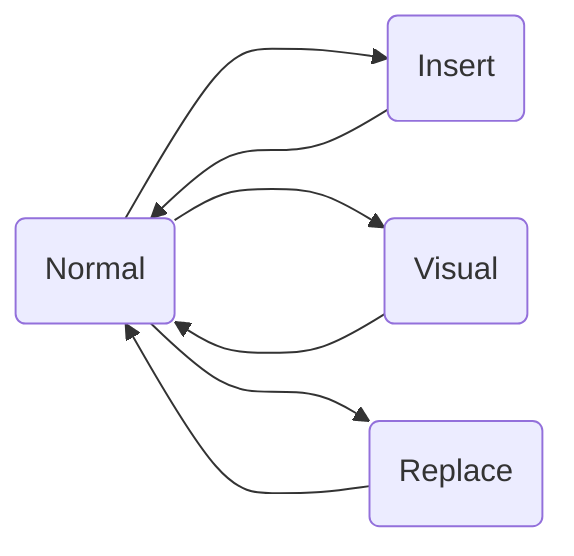

<!-- 我的vim设置 -->

# vim? 那是个什么 JB 东西？

Enjoy coding 的你，是否时常痛恨鼠标点来点去、方向键远离字母，耽误码字？可曾詈骂手动批量重复处理的痛苦？Debug 时代码上下反复跳转，令你烦闷否？别人写的编辑器设置种种不便，是否想过有一个自己私人订制的编辑器？如果你有以上苦恼，那么 vim 将是你的绝佳选择。

vim 是一个文本编辑器，素有"编辑器之神"的美名，同时它也是 Linux 尤其是服务器连接编辑的主要方法。

vim 的主要特点是分模式编辑：

| 模式    | 说明      | 功能                             |
| ------- | --------- | -------------------------------- |
| Normal  | 正常      | 光标移动、阅读文件               |
| Insert  | 插入      | 在当前光标位置插入内容，编辑文件 |
| Visual  | 视觉/选择 | 选中、复制粘贴                   |
| Replace | 替换      | 替换当前光标下字符               |

其关系如下：



# 我的 vim 学习路线

不幸的是 Vim 的学习曲线确实相当陡峭，我花了很久才适应了用 Vim 进行开发的过程。最开始你会觉得非常不适应，但一旦熬过了初始阶段，相信我，你会爱上 Vim。以我而言，现在离开了 vim 的模式几乎已经快不会写材料了，前几天交作业要求 word，我保存文件居然不是<kbd>Ctrl+s</kbd>，而是顺手来了个<kbd>:wqa</kbd>。

我的 vim 学习路线如下：

- 环境：虚拟机 Ubuntu22.04 LTS 环境，vim。也可以使用 windows 下的 gvim/neovim 或 gitbash 自带 vim 等。
- 首先，阅读和观看 MIT 的`Missing Semister`中关于 vim 的[课程](https://missing.csail.mit.edu/2020/editors/)。**消失的学期其他课程也非常不错。要是我刚上大学就知道有这个学期该多好！**
- 而后，在网上玩[Vim Adventures](https://vim-adventures.com/)，多玩几遍，直到熟悉其所有键位。~~**“家贫，无从致游戏以玩”**，谁要是有这个游戏全版，记得 v 我一份！~~
- 同时，在命令行中学`vimtutor`，这是 vim 自带的基础官方教程，对于基础使用方法介绍非常完整。
  - 系统如果是中文则该教程是中文，否则为英文，不过这点英文初中英语就足以应付了。
  - 使用方法为在命令行中输入<kbd>vimtutor</kbd>并回车。学习过程中尽量不要退出，因为教程不会保存本次做过的操作，下次再进来是个新的。
  - 第一次学会慢一些，一小时左右，一共 7 章若干节，一节一个技能，每一章有一个总结。
- 用了 vim，你难道不觉得键盘上的 Esc 放那么远简直倒灶吗？没错，我也这么觉得。于是我们想到自己做[键盘映射](./keymap.html)

想了解其他信息，可以参考 CSDiy 的[vim 指南](https://csdiy.wiki/%E5%BF%85%E5%AD%A6%E5%B7%A5%E5%85%B7/Vim/)。当然，众所周知，学习工具的核心在于使用，用起来逢山开路遇水搭桥，才最具效率和效果，_isn't it?_ 现代的我们，大多数情况的代码都有 IDE，但 vim 的分模式编辑和高度定制化一定会帮我们在 Coding 之路上快马加鞭。在你的各种 IDE 里安装 vim 插件，练起来，享受 All in One 的乐趣吧！

# 我的 vim 配置

网上一般的教程都说 vim 的默认配置文件为`~/.vimrc`。这当然是不错的，但是有一个巨大的问题：家目录是随着用户而不同的，这会导致我们以当前普通用户打开 vim 编辑文件与以 root 用户使用 vim 的观感完全不一致，就很烦。解决方法是**直接编辑 vim 默认的最根本的 vimrc**，不管什么用户都会先加载该文件的配置而后加载用户配置。

vim 默认的最根本的 vimrc 在`/etc/vim`下的 vimrc。为了便于后续编辑，我们可以在家目录下创建一个软链接，每次只需要编辑链接里的文件即可自动改变原来的文件。但需要注意，编辑该文件夹内的内容仍然需要 sudo 权限。

除此之外，出于同样的目的（保证当前用户与 root 用户观感一致），建议将插件也指定一个专门的绝对路径。我放在了`/home/player/useful/bundle`。

```
# 创建软链接
# 我习惯把有用的文件放在～/useful下
mkdir useful
cd useful

# 创建软链接
sudo ln -s /etc/vim /home/player/useful/vim

# 插件存放位置
mkdir bundle
```

## 设置

下文所有设置的目录均为`/home/player/useful/vim`，也即`/etc/vim`。由于内容过多，我在目录下创建了`vimrcs`文件夹，将不同内容分别以专门文件管理，vimrc 文件调用这些文件。因此，下边只有`vimrc`在`/etc/vim`下；其他文件均在`/etc/vim/vimrcs`下，以`./vimrcs/<文件名>`表示。插件放置在`/home/player/useful/bundle`。

### vimrc

```vim
" Vundle插件管理及插件内容
if filereadable(expand("/etc/vim/vimrcs/plugs.vim"))
  source /etc/vim/vimrcs/plugs.vim
endif

" 自行设置
if filereadable(expand("/etc/vim/vimrcs/myset.vim"))
  source /etc/vim/vimrcs/myset.vim
endif

" 符号自动匹配
if filereadable(expand("/etc/vim/vimrcs/match.vim"))
  source /etc/vim/vimrcs/match.vim
endif

" 不知道是什么
if filereadable(expand("/etc/vim/vimrcs/fuck.vim"))
  source /etc/vim/vimrcs/fuck.vim
endif

" 自己设的快捷键
if filereadable(expand("/etc/vim/vimrcs/keybind.vim"))
  source /etc/vim/vimrcs/keybind.vim
endif

" 自动命令
if filereadable(expand("/etc/vim/vimrcs/autocmd.vim"))
  source /etc/vim/vimrcs/autocmd.vim
endif
```

### ./vimrcs/plugs.vim

```vim
" Vundle插件管理器配置
set nocompatible               "去除VIM一致性，必须"
filetype off                   "必须"

"设置包括vundle和初始化相关的运行时路径"
set rtp+=/home/player/useful/bundle/Vundle.vim
call vundle#begin('/home/player/useful/bundle')

Plugin 'VundleVim/Vundle.vim'	"启用vundle管理插件，必须"
Plugin 'Valloric/YouCompleteMe'
Plugin 'preservim/nerdtree'
Plugin 'Xuyuanp/nerdtree-git-plugin' "nerdtree git支持
Plugin 'skywind3000/vim-terminal-help'
Plugin 'scrooloose/syntastic'
Plugin 'Lokaltog/powerline',{'rtp':'powerline/bindings/vim/'}

"在此增加其他插件，安装的插件需要放在vundle#begin和vundle#end之间"
"安装github上的插件格式为 Plugin '用户名/插件仓库名'"

 call vundle#end()

filetype plugin indent on     "加载vim自带和插件相应的语法和文件类型相关脚本，必须"

" YouCompleteMe
let g:ycm_global_ycm_extra_conf='/home/player/useful/bundle/YouCompleteMe/.ycm_extra_conf.py'
let g:ycm_key_invoke_completion = '<C-c>'
let g:ycm_semantic_triggers =  {
			\ 'c,cpp,python,java,go,erlang,perl': ['re!\w{2}'],
			\ 'cs,lua,javascript': ['re!\w{2}'],
			\ }
highlight PMenu ctermfg=34 ctermbg=21 guifg=darkred guibg=darkblue
highlight PMenuSel ctermfg=21 ctermbg=34 guifg=darkblue guibg=darkred
let g:ycm_autoclose_preview_window_after_completion=1 "窗口在完成操作后消失
map <leader>g :YcmCompleter GoToDefinitionElseDeclaration<CR> "找到当前内容定义位置的快捷方式

"NERDTree
autocmd vimenter * NERDTree "进入vim自动打开nerdtree
autocmd bufenter * if(winnr("$") == 1 && exists("b:NERDTree") && b:NERDTree.isTabTree()) | q | endif "当nerdtree为剩余唯一窗口时自动关闭
map <F2> :NERDTreeToggle<CR> "F2键开关文件目录树，注意shift+i切换是否显示隐藏文件
let g:NERDTreeDirArrowExpandable = '+'
let g:NERDTreeDirArrowCollapsible = '-' "修改树的显示图标
"let g:NERDTreeWinPos='left' "窗口位置
let g:NERDTreeSize=10"窗口尺寸
let g:NERDTreeShowLineNumbers=1 "窗口是否显示行号
"let g:NERDTreeHidden=1 "似乎是隐藏文件的旧命令？没看到作用
let NERDTreeShowHidden=1 " 显示隐藏文件
let NERDTreeIgnore = ['\.pyc$', '\.swp', '\.swo', '\.vscode', '__pycache__'] " 过滤: 所有指定文件和文件夹不显示
autocmd BufWinEnter * if getcmdwintype() == '' | silent NERDTreeMirror | endif " 在每个标签页打开相同的文件树


"nerdtree-git-plugin
let g:NERDTreeGitStatusIndicatorMapCustom = {
                \ 'Dirty'     :'Dir',
                \ 'Modified'  :'M',
                \ 'Staged'    :'S',
                \ 'Untracked' :'U',
                \ 'Renamed'   :'R',
                \ 'Unmerged'  :'UM',
                \ 'Deleted'   :'X',
                \ 'Ignored'   :'Ig',
                \ 'Clean'     :'Cl',
                \ 'Unknown'   :'?',
                \ }
let g:NERDTreeGitStatusShowIgnored = 1 " a heavy feature may cost much more time. default: 0
let g:NERDTreeGitStatusUntrackedFilesMode = 'all' " a heavy feature too. default: normal
"let g:NERDTreeGitStatusGitBinPath = '/your/file/path' " default: git (auto find in path)

"vim-terminal-help
set termwinsize=10*120

"syntastic
"以下内容是syntastic插件的一般配置，由于YouCompleteMe插件对该插件支持过于优秀，一般不再需要配置，故废弃
"set statusline+=%#warningmsg#
"set statusline+=%{syntasticstatuslineflag()}
"set statusline+=%*
"
"let g:syntastic_always_populate_loc_list = 1
"let g:syntastic_auto_loc_list = 1
"let g:syntastic_check_on_open = 1
"let g:syntastic_check_on_wq = 0
""设置error和warning的标志
"let g:syntastic_enable_signs = 1
""let g:syntastic_error_symbol='?'
"let g:syntastic_warning_symbol='?'
""no-unused-args 忽略不使用的参数
""no-redefined 忽略重定义
""no-max-line-length 忽略每行最长的检测
""ignore 542 551 忽略if条件的body为空(如...elseif ret == nil then end，then和end中间没有语句)；忽略空语句(如;)，如果用了;则成对出现该语法检测warning
""有语法错误的一行左侧栏会有s&gt;标识，光标移动到改行，vim下发会给出提示。修改正确后保存，则该's&gt;'会消失。
"let g:syntastic_lua_checkers = ["/usr/bin/luac5.3.5", "luacheck"]
"let g:syntastic_lua_luacheck_args = "--codes --no-max-comment-line-length --ignore 542 551"
"
""c
""let g:syntastic_c_compiler =['gcc', 'clang', 'make']
""let g:syntastic_c_compiler_options ='-wpedantic -g'
"let g:syntastic_c_compiler_options ='-std=gnu99'
"let g:syntastic_c_include_dirs=['/usr/include/']
"let g:syntastic_c_config_file='.syntastic_c_config_file'
"
""cpp
"let g:syntastic_cpp_include_dirs = ['/usr/include/']
"let g:syntastic_cpp_remove_include_errors = 1
"let g:syntastic_cpp_check_header = 1
"let g:syntastic_cpp_compiler = 'clang++'
"let g:syntastic_cpp_compiler_options = '-std=c++11 -stdlib=libstdc++'
"" syntastic end
let g:syntastic_python_checkers=['pylint']
let g:syntastic_python_pylint_args=['--disable=C0111,R0903,C0301']


" powerline
let laststatus=2
let g:airlinr_powerline_fonts=1 " 使用官方打过补丁的字体
let g:Powerline_symbols='fancy'
```

### ./vimrcs/myset.vim

```vim
set nocp    "设置兼容
set expandtab   "设置tab
set shiftwidth=4    "设置tab的间隔
set tabstop=4   "四个空格代表一个tab
set sts=4
set showmatch   "在输入括号时光标会短暂地跳到与之相匹配的括号处
set autoindent  "设置自动缩进
" set smartindent "设置智能缩进
set nowrap    "设置自动换行
set tw=500
set lbr
set foldmethod=indent "设置按缩进折叠代码
set foldlevel=99 "折叠层级
nnoremap <space> za "空格代替za进行展开和折叠
"===set guifont=Monospace "设置字体大小
set guifont=:b:h16
set encoding=utf-8  "设置编码为utf-8
set fileencoding=utf-8
set fileencodings=ucs-bom,utf-8,GB18030,cp936,big5,euc-jp,euc-kr,latin1
set helplang=cn "帮助中文支持
"colorscheme evening "设置主体颜色
set mouse=a " 设置鼠标

"自动补全配置
autocmd FileType python set omnifunc=pythoncomplete#Complete
autocmd FileType javascript set omnifunc=javascriptcomplete#CompleteJS
autocmd FileType html set omnifunc=htmlcomplete#CompleteTags
autocmd FileType css set omnifunc=csscomplete#CompleteCSS
autocmd FileType xml set omnifunc=xmlcomplete#CompleteTags
autocmd FileType php set omnifunc=phpcomplete#CompletePHP
autocmd FileType c set omnifunc=ccomplete#Complete

"进行Taglist的设置
map <F3> :TlistToggle<CR>
"map <F3> :silent! Tlist<CR>             "按下F3就可以呼出了
"let Tlist_Ctags_Cmd='/usr/bin/ctags'    "因为我们放在环境变量里，所以可以直接执行
let Tlist_Use_Right_Window=1            "让窗口显示在右边，0的话就是显示在左边
"let Tlist_Show_One_File=1               "让taglist可以同时展示多个文件的函数列表
"let Tlist_File_Fold_Auto_Close=1        "非当前文件，函数列表折叠隐藏
"let Tlist_Exit_OnlyWindow=1             "当taglist是最后一个分割窗口时，自动推出vim
"let Tlist_Process_File_Always=0         "是否一直处理tags.1:处理;0:不处理
"let Tlist_Inc_Winwidth=0                "不是一直实时更新tags，因为没有必要

set rnu "设置相对行号
set nu "设置绝对行号
" Set cursor shape and color
if &term =~ "xterm"
    " INSERT mode
    let &t_SI = "\<Esc>[6 q" . "\<Esc>]12;blue\x7"
    " REPLACE mode
    let &t_SR = "\<Esc>[3 q" . "\<Esc>]12;black\x7"
    " NORMAL mode
    let &t_EI = "\<Esc>[2 q" . "\<Esc>]12;green\x7"
endif
" 1 -> blinking block  闪烁的方块
" 2 -> solid block  不闪烁的方块
" 3 -> blinking underscore  闪烁的下划线
" 4 -> solid underscore  不闪烁的下划线
" 5 -> blinking vertical bar  闪烁的竖线
" 6 -> solid vertical bar  不闪烁的竖线

syntax on
set cul
set cuc
hi CursorLine   cterm=NONE ctermbg=darkred ctermfg=white guibg=darkred guifg=white
""set lines=35 columns=118
colorscheme darkblue "设置颜色主题
set wrap "设置自动折行
```

### ./vimrcs/match.vim

```vim
"各类符号自动匹配
:inoremap ( ()<ESC>i
:inoremap ) <c-r>=ClosePair(')')<CR>
:inoremap { {}<ESC>i
:inoremap } <c-r>=ClosePair('}')<CR>
:inoremap [ []<ESC>i
:inoremap ] <c-r>=ClosePair(']')<CR>

function ClosePair(char)
    if getline('.')[col('.') - 1] == a:char
        return "<Right>"
    else
        return a:char
    endif
endfunction
```

### ./vimrcs/fuck.vim

```vim
" 键盘映射设置区域

" 对应使用函数的配置
set guitablabel=%{ShortTabLabel()}
function ShortTabLabel ()
  let bufnrlist = tabpagebuflist (v:lnum)
  let label = bufname (bufnrlist[tabpagewinnr (v:lnum) -1])
  let filename = fnamemodify (label, ':t')
  return filename
endfunction

set tabline=%!MyTabLine()
function MyTabLine()
  let s = ''
  for i in range(tabpagenr('$'))
    " 选择高亮
    if i + 1 == tabpagenr()
      let s .= '%#TabLineSel#'
    else
      let s .= '%#TabLine#'
    endif
    " 设置标签页号 (用于鼠标点击)
    let s .= '%' . (i + 1) . 'T'
    " MyTabLabel() 提供完整路径标签 MyShortTabLabel 提供文件名标签
    let s .= ' %{MyShortTabLabel(' . (i + 1) . ')} '
  endfor
  " 最后一个标签页之后用 TabLineFill 填充并复位标签页号
  let s .= '%#TabLineFill#%T'
  " 右对齐用于关闭当前标签页的标签
  if tabpagenr('$') > 1
    let s .= '%=%#TabLine#%999Xclose'
  endif
  return s
endfunction
" 文件名标签
function MyShortTabLabel(n)
  let buflist = tabpagebuflist(a:n)
  let label = bufname (buflist[tabpagewinnr (a:n) -1])
  let filename = fnamemodify (label, ':t')
  return filename
endfunction
"完整路径标签
function MyTabLabel(n)
  let buflist = tabpagebuflist(a:n)
  let winnr = tabpagewinnr(a:n)
  return bufname(buflist[winnr - 1])
endfunction
" vim 标签样式
"  TabLineFill  tab pages line, where there are no labels
hi TabLineFill term=none
hi TabLineFill ctermfg=DarkGrey
hi TabLineFill guifg=#777777
"  TabLineSel   tab pages line, active tab page label
hi TabLineSel term=inverse
hi TabLineSel cterm=none ctermfg=yellow ctermbg=Black
hi TabLineSel gui=none guifg=yellow guibg=Black

" Develop editing options
au FileType vim setl expandtab
au FileType vim setl shiftwidth=2
au FileType vim setl tabstop=2

" 显示状态栏(默认值为 1，无法显示状态栏)
set laststatus=2
" Format the statusline
" set statusline= %f %m %r %h %w  CWD: %r%{CurDir()}E5%h   Line: %l/%L:%c

function! CurDir()
    let curdir = substitute(getcwd(), '/Users/amir/', "~/", "g")
    return curdir
endfunction
```

### ./vimrcs/keybind.vim

```vim
map - dd
map up 20k
map ne 20j
map end G
map ta $
"map <C-l> <C-w-l>
nmap <C-tab> :tabn<CR>
nmap <tab> :tabp<CR>
"nmap <alt-tab> :tabnew<CR>
map <space>= <buffer><esc>:vertical resize +5<cr>
map <space>- <esc>:vertical resize -5<cr>

nn <M-1> 1gt
nn <M-2> 2gt
nn <M-3> 3gt
nn <M-4> 4gt
nn <M-5> 5gt
nn <M-6> 6gt
nn <M-7> 7gt
nn <M-8> 8gt
nn <M-9> 9gt
nn <M-0> :tablast<CR>

"光标在页面间切换
nnoremap <space>h <C-w><C-h>
nnoremap <space>j <C-w><C-j>
nnoremap <space>k <C-w><C-k>
nnoremap <space>l <C-w><C-l>

"复制粘贴
"vnoremap <C-y> "+y
"nnoremap <C-p> "+p

" 其他开发配置
" Python
au BufNewFile,BufRead *.py
    \ set tabstop=4 |
    \ set shiftwidth=4 |
    \ set textwidth=79 |
    \ set expandtab |
    \ set autoindent |
    \ set fileformat=unix |
```

### ./vimrcs/autocmd.vim

```vim
autocmd BufReadPost,BufWritePre *.html,*.c,*.cpp normal gg=G
autocmd Filetype html,markdown setlocal nowrap
"autocmd Filetype c,cpp map <buffer><C-p> I//<esc>
autocmd Filetype c,cpp map <buffer><C-d> 0xx<esc>ta
"autocmd Filetype c,cpp vmap <buffer><C-p> <C-v>I//<esc>
"autocmd Filetype python map <buffer><C-p> I# <esc>
autocmd Filetype python map <buffer><C-d> 0xx<esc>ta
"autocmd Filetype python vmap <buffer><C-p> <C-v>I# <esc>
"autocmd Filetype c,cpp vmap <buffer><C-d> <C-v>0xx
"说明：本文件上文所有<Ctrl-p>的设置，原是用来为c,cpp,python文件设置注释的，但是注释可以通过<Ctrl-v>进入块选模式而后<Ctrl-i>进入插入模式，在前边输入注释符号，保存，则选中的行均被注释，甚为方便，因此这许多键一起弃用。
```
