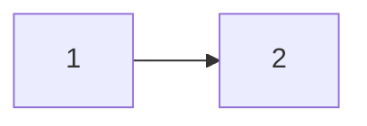

[Zeal](https://zealdocs.org)支持 200 多种常见技术文档的离线下载和安装，并可以离线搜索查看，支持 Windows、Linux、MacOS，Windows 版支持免安装的 Portable 版本。这对于需要经常访问国外技术文档但网络环境不好的小伙伴来说，Zeal 是绝对真香。

# 基本使用

- **下载完成后**，点击<kbd>Edit-->Preferences</kbd>，选择<kbd>Global</kbd>，在<kbd>Docset storage</kbd>中设置文档存储位置（空路径），保存

> 推荐在下载之前就设置好，文档下载下来如果没有专门记录的话很难想到找对应位置。所以墙裂推荐在设置好之后，在显眼的地方留一个快捷方式。

- 在<kbd>Tools-->Docsets</kbd>中查看已经下载的文档和可选择的文档，选择下载。
- 下载到本地后，在左上角即可搜索本地离线文档。

**就是这么方便！**

# 下载速度

Zeal 在国内的访问速度，不能说是快如闪电吧，好歹也跟蚂蚁爬有的一拼。因而，介绍如何手动下载文档。

## 获取可用列表

访问链接：[http://api.zealdocs.org/v1/docsets](http://api.zealdocs.org/v1/docsets)

这是 Zeal 可用文档列表信息，是一个 json 文件。如果访问较慢，可以访问这里：[12345](上山打老虎)，这是 2023 年 3 月 26 日的列表。

## 下载

首先，在可用列表查找需要的内容的名字，如查找 C++：

```json
{
        "sourceId": "com.kapeli",
        "name": "C++",
        "title": "C++",
        "versions": [],
        "revision": "73",
        "icon": ……,//这是一串编码，不重要
        "icon2x": ……//也还是一串编码
        "extra": {
            "indexFilePath": "output/en.cppreference.com/w/cpp.html"
        }
}
```

而后，查看对应的"name"值。

## 链接拼接

Zeal 文档下载链接格式：

```cpp
http://{city_name}.kapeli.com/feeds/{name}.tgz
```

- city_anme 是服务器所在的城市

- name 是刚刚找好的要下载文档的 name 值

其中，服务器分布城市有：

| frankfurt    | london    | newyork |
| ------------ | --------- | ------- |
| sanfrancisco | singapore | tokyo   |

根据测试，得到结果：

```
快——> 慢排序

http://tokyo.kapeli.com/feeds/{name}.tgz

http://singapore.kapeli.com/feeds/{name}.tgz

http://sanfrancisco.kapeli.com/feeds/{name}.tgz

http://frankfurt.kapeli.com/feeds/{name}.tgz

http://newyork.kapeli.com/feeds/{name}.tgz

http://sydney.kapeli.com/feeds/{name}.tgz

http://london.kapeli.com/feeds/{name}.tgz
```

此时，把所需文档的 name 替换掉链接中的{name}即可，得到下载链接如下：

```
http://tokyo.kapeli.com/feeds/ActionScript.tgz
http://tokyo.kapeli.com/feeds/Akka.tgz
http://tokyo.kapeli.com/feeds/Android.tgz
http://tokyo.kapeli.com/feeds/Angular.tgz
http://tokyo.kapeli.com/feeds/AngularJS.tgz
http://tokyo.kapeli.com/feeds/Ansible.tgz
http://tokyo.kapeli.com/feeds/Apache_HTTP_Server.tgz
http://tokyo.kapeli.com/feeds/Appcelerator_Titanium.tgz
http://tokyo.kapeli.com/feeds/AppleScript.tgz
http://tokyo.kapeli.com/feeds/Arduino.tgz
http://tokyo.kapeli.com/feeds/AWS_JavaScript.tgz
http://tokyo.kapeli.com/feeds/BackboneJS.tgz
http://tokyo.kapeli.com/feeds/Bash.tgz
http://tokyo.kapeli.com/feeds/Boost.tgz
http://tokyo.kapeli.com/feeds/Bootstrap_2.tgz
http://tokyo.kapeli.com/feeds/Bootstrap_3.tgz
http://tokyo.kapeli.com/feeds/Bootstrap_4.tgz
http://tokyo.kapeli.com/feeds/Bootstrap_5.tgz
http://tokyo.kapeli.com/feeds/Bourbon.tgz
http://tokyo.kapeli.com/feeds/C.tgz
http://tokyo.kapeli.com/feeds/C++.tgz
http://tokyo.kapeli.com/feeds/CakePHP.tgz
http://tokyo.kapeli.com/feeds/Cappuccino.tgz
http://tokyo.kapeli.com/feeds/Chai.tgz
http://tokyo.kapeli.com/feeds/Chef.tgz
http://tokyo.kapeli.com/feeds/Clojure.tgz
http://tokyo.kapeli.com/feeds/CMake.tgz
http://tokyo.kapeli.com/feeds/Cocos2D.tgz
http://tokyo.kapeli.com/feeds/Cocos2D-X.tgz
http://tokyo.kapeli.com/feeds/Cocos3D.tgz
http://tokyo.kapeli.com/feeds/CodeIgniter.tgz
http://tokyo.kapeli.com/feeds/CoffeeScript.tgz
http://tokyo.kapeli.com/feeds/ColdFusion.tgz
http://tokyo.kapeli.com/feeds/Common_Lisp.tgz
http://tokyo.kapeli.com/feeds/Compass.tgz
http://tokyo.kapeli.com/feeds/Cordova.tgz
http://tokyo.kapeli.com/feeds/Corona.tgz
http://tokyo.kapeli.com/feeds/CouchDB.tgz
http://tokyo.kapeli.com/feeds/Craft.tgz
http://tokyo.kapeli.com/feeds/CSS.tgz
http://tokyo.kapeli.com/feeds/D3JS.tgz
http://tokyo.kapeli.com/feeds/Dart.tgz
http://tokyo.kapeli.com/feeds/Django.tgz
http://tokyo.kapeli.com/feeds/Docker.tgz
http://tokyo.kapeli.com/feeds/Doctrine_ORM.tgz
http://tokyo.kapeli.com/feeds/Dojo.tgz
http://tokyo.kapeli.com/feeds/Drupal_7.tgz
http://tokyo.kapeli.com/feeds/Drupal_8.tgz
http://tokyo.kapeli.com/feeds/Drupal_9.tgz
http://tokyo.kapeli.com/feeds/ElasticSearch.tgz
http://tokyo.kapeli.com/feeds/Elixir.tgz
http://tokyo.kapeli.com/feeds/Emacs_Lisp.tgz
http://tokyo.kapeli.com/feeds/EmberJS.tgz
http://tokyo.kapeli.com/feeds/Emmet.tgz
http://tokyo.kapeli.com/feeds/Erlang.tgz
http://tokyo.kapeli.com/feeds/Express.tgz
http://tokyo.kapeli.com/feeds/ExpressionEngine.tgz
http://tokyo.kapeli.com/feeds/ExtJS.tgz
http://tokyo.kapeli.com/feeds/Flask.tgz
http://tokyo.kapeli.com/feeds/Font_Awesome.tgz
http://tokyo.kapeli.com/feeds/Foundation.tgz
http://tokyo.kapeli.com/feeds/GLib.tgz
http://tokyo.kapeli.com/feeds/Go.tgz
http://tokyo.kapeli.com/feeds/Gradle_DSL.tgz
http://tokyo.kapeli.com/feeds/Gradle_Java_API.tgz
http://tokyo.kapeli.com/feeds/Gradle_User_Guide.tgz
http://tokyo.kapeli.com/feeds/Grails.tgz
http://tokyo.kapeli.com/feeds/Groovy.tgz
http://tokyo.kapeli.com/feeds/Groovy_JDK.tgz
http://tokyo.kapeli.com/feeds/Grunt.tgz
http://tokyo.kapeli.com/feeds/Gulp.tgz
http://tokyo.kapeli.com/feeds/Haml.tgz
http://tokyo.kapeli.com/feeds/Handlebars.tgz
http://tokyo.kapeli.com/feeds/Haskell.tgz
http://tokyo.kapeli.com/feeds/HTML.tgz
http://tokyo.kapeli.com/feeds/Ionic.tgz
http://tokyo.kapeli.com/feeds/Jasmine.tgz
http://tokyo.kapeli.com/feeds/Java_EE6.tgz
http://tokyo.kapeli.com/feeds/Java_EE7.tgz
http://tokyo.kapeli.com/feeds/Java_EE8.tgz
http://tokyo.kapeli.com/feeds/Java_SE10.tgz
http://tokyo.kapeli.com/feeds/Java_SE11.tgz
http://tokyo.kapeli.com/feeds/Java_SE12.tgz
http://tokyo.kapeli.com/feeds/Java_SE13.tgz
http://tokyo.kapeli.com/feeds/Java_SE14.tgz
http://tokyo.kapeli.com/feeds/Java_SE15.tgz
http://tokyo.kapeli.com/feeds/Java_SE16.tgz
http://tokyo.kapeli.com/feeds/Java_SE6.tgz
http://tokyo.kapeli.com/feeds/Java_SE7.tgz
http://tokyo.kapeli.com/feeds/Java_SE8.tgz
http://tokyo.kapeli.com/feeds/Java_SE9.tgz
http://tokyo.kapeli.com/feeds/JavaFX.tgz
http://tokyo.kapeli.com/feeds/JavaScript.tgz
http://tokyo.kapeli.com/feeds/Jekyll.tgz
http://tokyo.kapeli.com/feeds/Jinja.tgz
http://tokyo.kapeli.com/feeds/Joomla.tgz
http://tokyo.kapeli.com/feeds/jQuery.tgz
http://tokyo.kapeli.com/feeds/jQuery_Mobile.tgz
http://tokyo.kapeli.com/feeds/jQuery_UI.tgz
http://tokyo.kapeli.com/feeds/Julia.tgz
http://tokyo.kapeli.com/feeds/KnockoutJS.tgz
http://tokyo.kapeli.com/feeds/Kobold2D.tgz
http://tokyo.kapeli.com/feeds/Laravel.tgz
http://tokyo.kapeli.com/feeds/LaTeX.tgz
http://tokyo.kapeli.com/feeds/Less.tgz
http://tokyo.kapeli.com/feeds/Lo-Dash.tgz
http://tokyo.kapeli.com/feeds/Lua_5.1.tgz
http://tokyo.kapeli.com/feeds/Lua_5.2.tgz
http://tokyo.kapeli.com/feeds/Lua_5.3.tgz
http://tokyo.kapeli.com/feeds/Lua_5.4.tgz
http://tokyo.kapeli.com/feeds/MarionetteJS.tgz
http://tokyo.kapeli.com/feeds/Markdown.tgz
http://tokyo.kapeli.com/feeds/Matplotlib.tgz
http://tokyo.kapeli.com/feeds/Meteor.tgz
http://tokyo.kapeli.com/feeds/Mocha.tgz
http://tokyo.kapeli.com/feeds/MomentJS.tgz
http://tokyo.kapeli.com/feeds/MongoDB.tgz
http://tokyo.kapeli.com/feeds/Mongoose.tgz
http://tokyo.kapeli.com/feeds/Mono.tgz
http://tokyo.kapeli.com/feeds/MooTools.tgz
http://tokyo.kapeli.com/feeds/MySQL.tgz
http://tokyo.kapeli.com/feeds/Neat.tgz
http://tokyo.kapeli.com/feeds/NET_Framework.tgz
http://tokyo.kapeli.com/feeds/Nginx.tgz
http://tokyo.kapeli.com/feeds/NodeJS.tgz
http://tokyo.kapeli.com/feeds/NumPy.tgz
http://tokyo.kapeli.com/feeds/OCaml.tgz
http://tokyo.kapeli.com/feeds/OpenCV.tgz
http://tokyo.kapeli.com/feeds/OpenGL_2.tgz
http://tokyo.kapeli.com/feeds/OpenGL_3.tgz
http://tokyo.kapeli.com/feeds/OpenGL_4.tgz
http://tokyo.kapeli.com/feeds/Pandas.tgz
http://tokyo.kapeli.com/feeds/Perl.tgz
http://tokyo.kapeli.com/feeds/Phalcon.tgz
http://tokyo.kapeli.com/feeds/PhoneGap.tgz
http://tokyo.kapeli.com/feeds/PHP.tgz
http://tokyo.kapeli.com/feeds/PHPUnit.tgz
http://tokyo.kapeli.com/feeds/Play_Java.tgz
http://tokyo.kapeli.com/feeds/Play_Scala.tgz
http://tokyo.kapeli.com/feeds/Polymer.dart.tgz
http://tokyo.kapeli.com/feeds/PostgreSQL.tgz
http://tokyo.kapeli.com/feeds/Processing.tgz
http://tokyo.kapeli.com/feeds/PrototypeJS.tgz
http://tokyo.kapeli.com/feeds/Pug.tgz
http://tokyo.kapeli.com/feeds/Puppet.tgz
http://tokyo.kapeli.com/feeds/Python_2.tgz
http://tokyo.kapeli.com/feeds/Python_3.tgz
http://tokyo.kapeli.com/feeds/Qt_4.tgz
http://tokyo.kapeli.com/feeds/Qt_5.tgz
http://tokyo.kapeli.com/feeds/Qt_6.tgz
http://tokyo.kapeli.com/feeds/R.tgz
http://tokyo.kapeli.com/feeds/Racket.tgz
http://tokyo.kapeli.com/feeds/React.tgz
http://tokyo.kapeli.com/feeds/Redis.tgz
http://tokyo.kapeli.com/feeds/RequireJS.tgz
http://tokyo.kapeli.com/feeds/Ruby.tgz
http://tokyo.kapeli.com/feeds/Ruby_2.tgz
http://tokyo.kapeli.com/feeds/Ruby_3.tgz
http://tokyo.kapeli.com/feeds/Ruby_on_Rails_3.tgz
http://tokyo.kapeli.com/feeds/Ruby_on_Rails_4.tgz
http://tokyo.kapeli.com/feeds/Ruby_on_Rails_5.tgz
http://tokyo.kapeli.com/feeds/Ruby_on_Rails_6.tgz
http://tokyo.kapeli.com/feeds/RubyMotion.tgz
http://tokyo.kapeli.com/feeds/Rust.tgz
http://tokyo.kapeli.com/feeds/SailsJS.tgz
http://tokyo.kapeli.com/feeds/SaltStack.tgz
http://tokyo.kapeli.com/feeds/Sass.tgz
http://tokyo.kapeli.com/feeds/Scala.tgz
http://tokyo.kapeli.com/feeds/SciPy.tgz
http://tokyo.kapeli.com/feeds/Semantic_UI.tgz
http://tokyo.kapeli.com/feeds/Sencha_Touch.tgz
http://tokyo.kapeli.com/feeds/Sinon.tgz
http://tokyo.kapeli.com/feeds/Smarty.tgz
http://tokyo.kapeli.com/feeds/Sparrow.tgz
http://tokyo.kapeli.com/feeds/Spring_Framework.tgz
http://tokyo.kapeli.com/feeds/SQLAlchemy.tgz
http://tokyo.kapeli.com/feeds/SQLite.tgz
http://tokyo.kapeli.com/feeds/Statamic.tgz
http://tokyo.kapeli.com/feeds/Stylus.tgz
http://tokyo.kapeli.com/feeds/Susy.tgz
http://tokyo.kapeli.com/feeds/SVG.tgz
http://tokyo.kapeli.com/feeds/Swift.tgz
http://tokyo.kapeli.com/feeds/Symfony.tgz
http://tokyo.kapeli.com/feeds/Tcl.tgz
http://tokyo.kapeli.com/feeds/Tornado.tgz
http://tokyo.kapeli.com/feeds/Twig.tgz
http://tokyo.kapeli.com/feeds/Twisted.tgz
http://tokyo.kapeli.com/feeds/TypeScript.tgz
http://tokyo.kapeli.com/feeds/TYPO3.tgz
http://tokyo.kapeli.com/feeds/UnderscoreJS.tgz
http://tokyo.kapeli.com/feeds/Unity_3D.tgz
http://tokyo.kapeli.com/feeds/Vagrant.tgz
http://tokyo.kapeli.com/feeds/Vim.tgz
http://tokyo.kapeli.com/feeds/VMware_vSphere.tgz
http://tokyo.kapeli.com/feeds/VueJS.tgz
http://tokyo.kapeli.com/feeds/WordPress.tgz
http://tokyo.kapeli.com/feeds/Xamarin.tgz
http://tokyo.kapeli.com/feeds/Xojo.tgz
http://tokyo.kapeli.com/feeds/XSLT.tgz
http://tokyo.kapeli.com/feeds/Yii.tgz
http://tokyo.kapeli.com/feeds/YUI.tgz
http://tokyo.kapeli.com/feeds/Zend_Framework_1.tgz
http://tokyo.kapeli.com/feeds/Zend_Framework_2.tgz
http://tokyo.kapeli.com/feeds/Zend_Framework_3.tgz
http://tokyo.kapeli.com/feeds/ZeptoJS.tgz
```

## 移动

下载完成后，对压缩包进行解压，并将解压所得文件夹整体放入上文规定的 Zeal 文档存储路径之下。

重启 Zeal，即可在左侧看到信息，可以在左上角搜索了。

# test



$$
\int_0^\frac \pi 2 \sin x =1
$$
