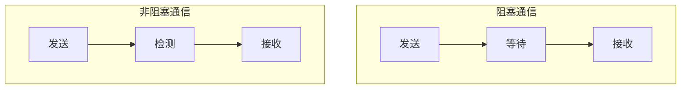

[toc]

# 基于共享内存的并行编程

## `Pthreads`的多线程并行

### 简介

`Pthreads`是 POSIX（类 Unix 系统的通用标准）为了支持多线程而提供的 API，在类 Unix 操作系统（GNU/Linux，Mac）可用，Windows 也已经由 MinGW/mingw-w64/msvc 等编译器实现。

在 C 语言使用该 API 时需引用头文件`#include <pthread.h>`

API 主要提供了如下几类功能：

- 线程管理
- 互斥量
- 路障（同步）
- 条件变量

### 线程管理

```c
#include <stdio.h>
#include <stdlib.h>
#include <pthread.h>

#define THREADS_NUM 10

void *hello(void* args)
{
    int i=(int)args;
    printf("Thread %d is here!\n",i);
    return NULL;
}

int main()
{
    /*
     * 创建线程变量
     * pthread_t 是一个32b整数，是线程id
     */
    pthread_t p[THREADS_NUM];
    int i;

    // 创建线程
    for(i=0;i<THREADS_NUM;i)
    {
        /*
         * 函数说明：
         * 第一个参数是线程id的地址
         * 第二个参数是线程调用函数返回的参数
         * 第三个是调用的函数名
         * 第四个是函数的参数列表，类型必须为void *类型（64b）
         * 如果是一个参数可以考虑强转，多个参数必须写进结构体或数组等，总之必须只能传一个void *参数
         */
        pthread_create(&p[i],NULL,hello,(void *)i);
    }
    for(i=0;i<THREADS_NUM;i++)
    {
        /*
         * 函数说明：
         * 这个函数是用来等待线程结束的，线程结束之后才会进行下一句
         * 第一个参数是线程id（不是地址！！！）
         * 第二个参数是线程返回值不为NULL时返回值存储的地址
         * 这里写成NULL只是因为这里不会异常返回，否则可以用别的参数接一下，用来做异常处理
         */
        pthread_join(p[i],NULL);
        /*
         * 如果不需要等待线程结束，换言之即将主线程与子线程分离，可以使用
         * pthread_detach(pthread_t thread)
         */
    }
    return 0;
}
```

### 互斥量

在多线程编程过程中，多个线程可能同时访问同一段数据，此时**如果至少有一个线程在写数据**，就会出现数据不一致的情况，称为**竞争条件**。为此，我们需要**临界区**。

临界区是指一个更新共享资源的代码段，**一次只允许一个线程访问该段代码**，目的是在多线程访问共享数据时保证数据的完整性，解决上述问题。之所以叫临界区，是**临各线程之界**。访问临界区的原则是：

- 一次只有一个线程访问
- 一个线程不能停留在里边一直访问

#### 忙等待

可以通过空循环的方法实现当一个线程在用的时候另一个线程禁止访问。

空口白话不好使，看代码吧，利用泰勒公式求$\pi$的值。

已知：

- $arctan(1)=\frac \pi 4$
- $arctan(x)=\Sigma_{i=0}^{+\infty}(-1)^i \frac 1 {2x+1}$，收敛域为$[-1,1]$

> 哪个大佬知道收敛更快的算法啊，这个办法**收敛实在是太慢辣**！

编程如下：

```c
#include <stdio.h>
#include <stdlib.h>
#include <pthread.h>

#define SUM_NUM 1000000000 // 求和累加次数
int flag=0; // 临界区标志位，这里用1/0等待，也可以让各个线程顺序访问之类别的方式
int CyclePerThread; // 每个线程计算次数
double pi=0; // pi的值

void *thread(void * args)
{
    int i=(int)args,j,k;
    double temp=0;
    for(j=0;j<CyclePerThread;j++)
    {
        k=j+i*CyclePerThread;
        temp+=(k%2==0?1.0:-1.0)/(2.0*k+1);
    }
    while(flag!=0)
    {
        ;
    }
    flag++;
    pi+=temp*4;
    flag--;

    return NULL;
}

int main()
{
    int n;// 线程数
    printf("Please input the number of threads: ");
    scanf("%d",&n);
    // 检查，防止除不尽导致最后一个线程计算次数不够
    if(SUM_NUM%n!=0)
    {
        printf("The number of threads is not suitable!\n");
        exit(1);
    }
    CyclePerThread=SUM_NUM/n;

    pthread_t *p=(pthread_t *)malloc(sizeof(pthread_t)*n);
    int i;
    for(i=0;i<n;i++)
    {
        pthread_create(&p[i],NULL,thread,(void *)i);
    }
    for(i=0;i<n;i++)
    {
        pthread_join(p[i],NULL);
    }
    printf("The value of pi is %.15lf\n",pi);
    return 0;
}
```

#### 互斥锁

上述**通过循环的办法实现的忙等待，优点在于实现比较简单好理解，缺点在于空循环浪费 CPU 资源，且当线程数较多时，线程切换的开销也会增大**。因此我们可以调用`Pthreads`提供的互斥锁来实现临界区的功能。互斥锁是一个变量，通过调用函数来实现锁定临界区实现忙等待。

```c
#include <stdio.h>
#include <stdlib.h>
#include <pthread.h>

#define SUM_NUM 1000000000 // 求和累加次数
pthread_mutex_t mutex; // 互斥锁
int CyclePerThread; // 每个线程计算次数
double pi=0; // pi的值

void *thread(void * args)
{
    int i=(int)args,j,k;
    double temp=0;
    for(j=0;j<CyclePerThread;j++)
    {
        k=j+i*CyclePerThread;
        temp+=(k%2==0?1.0:-1.0)/(2.0*k+1);
    }
    // 互斥锁可以保证该段代码同一时刻只有一个线程在操作
    pthread_mutex_lock(&mutex); // 加锁
    pi+=temp*4;
    pthread_mutex_unlock(&mutex); // 解锁

    return NULL;
}

int main()
{
    int n;// 线程数
    printf("Please input the number of threads: ");
    scanf("%d",&n);
    // 检查，防止除不尽导致最后一个线程计算次数不够
    if(SUM_NUM%n!=0)
    {
        printf("The number of threads is not suitable!\n");
        exit(1);
    }
    CyclePerThread=SUM_NUM/n;

    pthread_t *p=(pthread_t *)malloc(sizeof(pthread_t)*n);
    int i;
    /*
     * 初始化互斥锁，函数原型：
     * int pthread_mutex_init(pthread_mutex_t *mutex, const pthread_mutexattr_t *attr);
     * mutex：互斥锁变量
     * attr：互斥锁属性，一般为NULL
     */
    pthread_mutex_init(&mutex,NULL);

    for(i=0;i<n;i++)
    {
        pthread_create(&p[i],NULL,thread,(void *)i);
    }
    for(i=0;i<n;i++)
    {
        pthread_join(p[i],NULL);
    }
    // 销毁互斥锁
    pthread_mutex_destroy(&mutex);

    printf("The value of pi is %.15lf\n",pi);
    return 0;
}
```

可以看到，互斥锁的使用分以下几个步骤：

- 定义互斥锁变量
- 初始化互斥锁
- 临界区上锁
- 解锁
- 销毁互斥锁

#### 比较

通过实际数据比较，得出以下结论：

- 忙等待强调访问临界区的顺序（指按顺序访问的写法而言）
- 互斥量访问临界区顺序随机
- 当线程数多于 CPU 核数时，忙等待效率降低
- 有一些应用需要控制线程进入临界区的顺序
- 某些并行计算（如矩阵乘法）没有交换律，无法使用互斥量

### 信号量

信号量可以用于临界区，保护共享资源，其特性如下：

- 是一种特殊类型的`unsigned int`
- 要访问共享资源必须获取一个信号量，且信号量减 1
- 离开共享资源的线程释放信号量，信号量加 1
- 信号量为 0 时，试图访问共享资源的线程将处于等待状态

需要注意的是，上述的信号量只是一种管理方法，与`Pthreads`中的信号量似乎区别不小，这一点从`sem_t`的大小上就能看出来。凑合看吧，知道原理就行。

```c
#include <semaphore.h> // 信号量头文件

// 定义信号量
sem_t sem;

/*
 * 信号量初始化
 * sem: 信号量变量
 * pshared: 信号量的类型，0为线程间共享，非0为进程间共享，一般设置为0
 * value: 信号量的初始值
 */
int sem_init(sem_t *sem, int pshared, unsigned int value);

/*
 * 申请信号量，为0则等待，否则占用一个并减1
 */
int sem_wait(sem_t *sem);

/*
 * 释放信号量，信号量值加1
 */
int sem_post(sem_t *sem);

/*
 * 销毁信号量
 * sem: 信号量变量
 */
int sem_destroy(sem_t *sem);
```

一个示例：

- t 个线程，每个线程依次向后一个发送消息，最后一个向第 0 个发送消息
- 线程接收到消息后打印出来并终止
- 为实现消息传递，分配一个`char *`数组，每个线程初始化消息之后，共享数组的指针指向要发送的消息
- 主线程将共享数组初始化为`NULL`
- 信号量初始化为 0

```c
#include <stdio.h>
#include <pthread.h>
#include <semaphore.h>
#define MSG_MAX_LEN 50

int t;
char **msg=NULL:
sem_t *sem;

void *thread(void *args)
{
    int myRank=(int)args;
    int dest=(myRank+1)%t;
    sprintf(msg[dest],"Hello to from thread %d",dest,myRank);
    sem_post(&sem[dest]);
    sem_wait(&sem[myRank]);
    printf("Thread %d > %s\n",myRank,msg[myRank]);
    return NULL;
}

int main()
{
    int i;
    printf("Input the num of threads you want: ");
    scanf("%d",&t);

    // 内存申请与信号量初始化
    pthread_t *p=(pthread_t *)malloc(sizeof(pthread_t)*t);
    sem=(sem_t *)malloc(sizeof(sem_t)*t);
    msg=(char **)malloc(sizeof(char *)*t);
    for(i=0;i<t;i++)
    {
        sem_init(&sem[i],0,0);
        msg[i]=(char *)malloc(sizeof(char)*MSG_MAX_LEN);
    }

    // 线程创建与执行
    for(i=0;i<t;i++)
    {
        pthread_create(&p[i],NULL,thread,(void *)i);
    }
    for(i=0;i<t;i++)
    {
        pthread_join(p[i],NULL);
    }

    // 销毁与释放所有用过的空间
    for(i=0;i<t;i++)
    {
        sem_destroy(&sem[i]);
        free(msg[i]);
    }
    free(msg);
    free(sem);
    free(p);

    return 0;
}

```

信号量与互斥量最大的区别在于**信号量没有个体拥有权**，主线程将所有信号量初始化为 0，其他任何线程都能对任何信号量调用`sem_post`和`sem_wait`函数。

### 路障

路障也称同步点，指线程到达此处进入阻塞状态，等所有进程到达后才能继续进行，主要应用于程序计时/调试等。

路障使用有以下几步：

```c
#include <pthread.h>

// 定义路障
pthread_barrier_t barrier;

/*
 * 路障初始化
 * 第一个参数是路障变量地址
 * 第二个参数是路障属性对象，一般为NULL
 * 第三个参数是路障需要等待的线程数
 */
int pthread_barrier_init(pthread_barrier_t *barrier, const pthread_barrierattr_t *attr, unsigned int count);

// 等待路障
int pthread_barrier_wait(pthread_barrier_t *barrier);

// 销毁路障
int pthread_barrier_destroy(pthread_barrier_t *barrier);
```

示例程序如下：

```c
#include <stdio.h>
#include <stdlib.h>
#include <pthread.h>
#include <time.h>

pthread_barrier_t barrier;

void *thread(void * args)
{
    int i=(int)args;
    printf("------ Thread %d is here! ------\n",i);
    //模拟初始化
    sleep(rand()%20);
    // 到达路障
    pthread_barrier_wait(&barrier);
    // 都到了，开始
    printf("---- Thread %d starts to work! ----\n",i);
    //模拟执行
    sleep(rand()%200);
    printf("---- Thread %d is done! ----\n",i);
    return NULL;
}

int main()
{
    pthread_barrier_init(&barrier,NULL,3);

    printf("**** main thread barrier init done! ****\n");
    pthread_t p[2];
    pthread_create(&p[0],NULL,thread,NULL);
    pthread_create(&p[1],NULL,thread,NULL);

    // 主线程到达路障，等待
    pthread_barrier_wait(&barrier);

    // 都到了，毁灭吧
    pthread_barrier_destroy(&barrier);

    //开始执行
    printf("**** main thread starts to work! ****\n");
    sleep(rand()%100);
    printf("**** main thread is done! ****\n");
    pthread_join(p[0],NULL);
    pthread_join(p[1],NULL);
    return 0;
}
```

### 条件变量

条件变量使线程在特定条件或事件之前处于挂起状态。

```c
#include <pthread.h>

// 定义条件变量
pthread_cond_t cond;

/*
 * 条件变量初始化
 * 第一个参数是条件变量地址
 * 第二个参数是条件变量属性对象，一般为NULL
 */
int pthread_cond_init(pthread_cond_t *cond, const pthread_condattr_t *attr);

/*
 * 解锁一个阻塞的线程
 */
int pthread_cond_signal(pthread_cond_t *cond);

/*
 * 解锁所有阻塞的线程
 */
int pthread_cond_broadcast(pthread_cond_t *cond);

/*
 * 等待条件变量，即通过互斥锁阻塞线程
 * 第一个参数是条件变量地址
 * 第二个参数是互斥锁地址
 */
int pthread_cond_wait(pthread_cond_t *cond, pthread_mutex_t *mutex);
```

示例程序，这个程序真没看明白：

```c
#include <stdio.h>
#include <stdlib.h>
#include <pthread.h>
#include <unistd.h>

pthread_mutex_t mutex[2];
pthread_cond_t cond;

void *thread_task0(void *args)
{
    int cnt=1;
    while(1)
    {
        pthread_mutex_lock(&mutex[0]);
        printf("Thread 0: %d\n",cnt);
        cnt++;
        if(cnt%4==0)
        {
            // pthread_cond_signal(&cond);
            pthread_cond_broadcast(&cond);
        }
        pthread_mutex_unlock(&mutex[0]);
        sleep(1);
    }
}

void *thread_task1(void *args)
{
    while(1)
    {
        pthread_cond_wait(&cond,&mutex[1]);
        printf("Thread 1: I'm awake!\n");
    }
}

int main()
{
    pthread_t p[2];

    // 初始化互斥锁和条件变量
    pthread_mutex_init(&mutex[0],NULL);
    pthread_mutex_init(&mutex[1],NULL);
    pthread_cond_init(&cond,NULL);

    // 创建线程
    pthread_create(&p[0],NULL,thread_task0,NULL);
    pthread_create(&p[1],NULL,thread_task1,NULL);

    // 等待线程结束
    pthread_join(p[0],NULL);
    pthread_join(p[1],NULL);

    // 销毁
    pthread_mutex_destroy(&mutex[0]);
    pthread_mutex_destroy(&mutex[1]);
    pthread_cond_destroy(&cond);

    return 0;
}
```

### 读写锁

读写锁在互斥量的基础上，**把对共享资源的访问分为读者和写者**，读者只能读、写者只能写，读者之间不互斥，写者之间互斥，读者和写者之间互斥。

```c
#include <pthread.h> // 哈哈，没想到吧

// 定义读写锁
pthread_rwlock_t rwlock;

/*
 * 读写锁初始化
 * 第一个参数是读写锁地址
 * 第二个参数是读写锁属性对象，一般为NULL
 */
int pthread_rwlock_init(pthread_rwlock_t *rwlock, const pthread_rwlockattr_t *attr);

// 读加锁
int pthread_rwlock_rdlock(pthread_rwlock_t *rwlock);

// 写加锁
int pthread_rwlock_wrlock(pthread_rwlock_t *rwlock);

// 解锁
int pthread_rwlock_unlock(pthread_rwlock_t *rwlock);

// 销毁
int pthread_rwlock_destroy(pthread_rwlock_t *rwlock);
```

示例程序：

```c
#include <stdio.h>
#include <stdlib.h>
#include <string.h>
#include <pthread.h>
#include <unistd.h>
#include <errno.h>

#define MAX_DATA_LEN 1024

struct test
{
    char data[MAX_DATA_LEN];
    pthread_rwlock_t rwlock;
};

struct test share = { PTHREAD_RWLOCK_INITIALIZER };

void *reader(void *args)
{
    pthread_rwlock_rdlock(&share.rwlock);
    printf("Reader starts to read!\n");
    sleep(1);
    printf("Reader read: %s\n",share.data);
    pthread_rwlock_unlock(&share.rwlock);
    return NULL;
}

void *writer(void *args)
{
    char data_tmp[MAX_DATA_LEN];
    pthread_rwlock_wrlock(&share.rwlock);
    printf("Writer starts to write!\n");
    printf("Please input the data you want to write: ");
    gets(data_tmp);
    strcat(share.data,data_tmp);
    pthread_rwlock_unlock(&share.rwlock);
    return NULL;
}

int main(int argc,char *argv[])
{
    int i,readerCount,writerCount;
    pthread_t *readers,*writers;
    if(argc!=3)
    {
        printf("Usage: %s <reader count> <writer count>\n",argv[0]);
        exit(1);
    }

    readerCount=atoi(argv[1]);
    writerCount=atoi(argv[2]);
    readers=(pthread_t *)malloc(sizeof(pthread_t)*readerCount);
    writers=(pthread_t *)malloc(sizeof(pthread_t)*writerCount);

    for(int i=0;i<writerCount;i++)
    {
        pthread_create(&writers[i],NULL,writer,NULL);
    }
    sleep(10);
    for(int i=0;i<readerCount;i++)
    {
        pthread_create(&readers[i],NULL,reader,NULL);
    }

    for(int i=0;i<writerCount;i++)
    {
        pthread_join(writers[i],NULL);
    }
    for(int i=0;i<readerCount;i++)
    {
        pthread_join(readers[i],NULL);
    }

    free(readers);
    free(writers);
    pthread_rwlock_destroy(&share.rwlock);
    return 0;
}
```

### `Pthreads`总结

- 线程的管理（创建/终止/分离/同步）
- 临界区，互斥量，信号量
- 路障，条件变量，读写锁

## `OpenMP`的多线程并行

通过在源代码(串行)中添加 OpenMP 指令和调 用 OpenMP 库函数来实现在共享内存系统上的并行。OpenMP 为共享内存并行程序员提供了一种简单灵活的开发 并行应用的接口模型，使程序既可以在台式机执行 ，也可以在超级计算机执行，具有良好的可移植性。

- `Fortran/C/C++`自带 OpenMP 库，无需另外安装。
- 编译时需要代开 OpenMP 选项，如不打开则编译器会忽略 OpenMP 指令，生成纯串行的可执行程序（串行等价性）。
  - 对于`gcc`，需要添加`-fopenmp`选项。
  - 对于`clang`，需要添加`-fopenmp=libomp`选项。
  - 对于`icc`，需要添加`-openmp`选项。
- 运行时需要设置环境变量`OMP_NUM_THREADS`，如不设置则默认为 1；也可以在程序中进行指定。
- 编程方式：增量并行。是一种基于线程的并行编程模型。
- 支持与 MPI 混合编程。

### 执行方式说明

OpenMP 采用`Fork-Join`的并行编程方式，开始于一个单独的主线程，一直串行执行（串行域），直到遇见并行域；在并行域中，根据指定的线程数，多线程并行执行；并行域结束后，所有线程汇合，继续串行执行。如此在串行域和并行域中循环往复，直到程序结束。

需要注意的是，在并行域中，可以划分出更小的并行域，也就是一个线程再次划分为多个线程执行。


### 使用指南

```c
// 头文件必不可少
#include <omp.h>

// 指定线程数，这是一个函数，参数就是线程数
omp_set_num_threads(4);

// OpenMP的指令标识符
#pragma omp

/*
 * 一个并行域
 * 需要注意的是，如同C语言的一般规定一样，大括号内是一个代码块
 * 如果没有大括号，那就只有第一句属于上边的并行域/会被并行执行
 */
#pragma omp parallel
{
    // some codes here.
}
```

编译的时候，使用`-fopenmp`选项是万万不能忘记的：

```bash
gcc -g -o test test.c -fopenmp
```

在 OpenMP 程序编写中，需要注意以下几点：

- 通常采用增量并行，也局势每次只对部分代码并行化，这样可以**逐步改造**，方便调试
- OpenMP 指令**区分大小写**

先来一段小实例：

```c
#include <stdio.h>
#include <omp.h>

int main()
{
    omp_set_num_threads(10); // 设置线程数
    #pragma omp parallel
    printf("Hello World! I'm thread %d\n",omp_get_thread_num());
    printf("Hello World! I'm the master thread\n");
    return 0;
}
```

可以看到一般的结果为：

```plain
Hello World! I'm thread 1
Hello World! I'm thread 2
Hello World! I'm thread 3
Hello World! I'm thread 5
Hello World! I'm thread 6
Hello World! I'm thread 7
Hello World! I'm thread 0
Hello World! I'm thread 8
Hello World! I'm thread 4
Hello World! I'm thread 9
Hello World! I'm the master thread
```

### OpenMP 编程三要素

OpenMP 编程三大要素：

- 编译制导指令
- 运行时库函数
- 环境变量

#### 编译制导指令

| 语言    | 编译制导指令                                 |
| :------ | :------------------------------------------- |
| Fortran | `!$OMP construct [clause [clause]...]`       |
| C/C++   | `#pragma omp construct [clause [clause]...]` |

其中：

| `#pragma omp`                    | `construct`                                  | `clause`                     |
| :------------------------------- | :------------------------------------------- | :--------------------------- |
| 制导指令的前缀<br>所有指令必须有 | 制导指令<br>具体的指令，指导编译器进行并行化 | 子句<br>负责添加一些补充设置 |

编译制导指令有如下几种：

| 指令类型     | 说明                                                                   |
| :----------- | :--------------------------------------------------------------------- |
| 并行域指令   | 创建并行域                                                             |
| 工作共享指令 | 负责任务划分并分发给各个线程，不会产生新线程，必须放在并行域中         |
| 同步指令     | 并行线程之间的同步（也许类似于路障？）                                 |
| 数据环境     | 负责并行域内变量的属性（共享或私有）以及串行域与并行域边界上的数据传递 |

再次说明，不支持 OpenMP 的编译器也能编译 OpenMP 程序，不过是忽略了这部分语句，也就是直接串行执行。

#### 并行域指令

并行域指令前边写了，就不废话了。需要注意的是结尾处有隐式同步（等待所有线程结束才进入下一个串行域）。另外，可用的字句包括以下几种：

```c
if(scalar-logical-expression)
num_threads(scalar-integer-expression)
default(shared|none)
private(list)
firstprivate(list)
shared(list)
copyin(list)
reduction(operator:list)
```

#### 工作共享指令

工作共享指令，负责任务的划分和分配，在每个工作分享结构入口处无需同步，分享结构结束处会有隐式路障实现同步。工作共享指令主要有以下几种：

- `for`指令
- `sections`指令
- `single`指令
- `master`指令
- `task`指令

##### for 指令

```c
/*
 * for指令，自动划分和分配循环任务
 * 需要注意，循环变量只能是整形或指针
 */
#pragma omp for [clause [clause]...]
{
    // 这里写一个for循环
}
/*
 * 结尾处有隐式同步，可用的子句包括：
 * private(list),firstprivate(list),lastprivate(list)
 * reduction(operator:list)
 * schedule(kind[,chunk_size])
 * ordered
 * nowait
 */
```

示例程序：

```c
#include <omp.h>
#include <stdio.h>
#define N 10000

int main()
{
    int a[N],b[N],i;
    // 当并行域中就一个循环共享结构，
    // 则for指令与parallel指令结合使用也可以的
    #pragma omp parallel for num_threads(4)
    {
        for(i=0;i<N;i++)
        {
            b[i]=i;
            a[i]=2*b[i];
        }
    }
    // 也可以这样写
    // #pragma omp parallel num_threads(4)
    // {
    //     #pragma omp for
    //     {
    //         for(i=0;i<N;i++)
    //         {
    //             b[i]=i;
    //             a[i]=2*b[i];
    //         }
    //     }
    // }
    printf("a[0]=%d,a[%d]=%d\n",a[0],N-1,a[N-1]);
    return 0;
}
```

##### Schedule 任务调度

- 在上述循环共享结构中，将任务划分给各个线程的行为称为**调度**
- 任务调度方式直接影响程序效率：
  - 任务的均衡程度
  - 循环体内数据访问顺序与相应 Cache 冲突的情况
- 循环体任务调度基本原则：
  - 分解代价低
  - 任务计算量均衡
  - 尽量避免缓存冲突，提高缓存命中率

OpenMP 提供了以下几种调度方式（`schedule`子句）：

```c
schedule(static,chunk_size) // 静态分配，chunk_size为任务块大小
schedule(dynamic,chunk_size) // 动态分配，chunk_size为任务块大小，按照先来先服务原则分配
schedule(guided,chunk_size) // 动态分配。任务块大小可变，先大后小，chunk_size为最小任务块大小
schedule(runtime) // 具体调度方式在运行时才确定，由环境变量`OMP_SCHEDULE`指定
```

调度策略适用场景：

| 调度策略 | 适用场景                                  |
| :------- | :---------------------------------------- |
| static   | 每次迭代的工作可预测且相似                |
| dynamic  | 每次迭代的工作不可预测，高度不规则        |
| guided   | dynamic 的特例，可减少 dynamic 策略的负载 |

##### sections 指令

- 指令`sections`创建一个共享工作域
- 域中子任务由`section`创建，必须是一个相对独立完整的代码块
- 每个子任务**只会**被一个线程执行
- 结尾处隐式同步，除非有子句`nowait`

```c
/*
 * 可用子句：
 * private(list)
 * firstprivate(list)
 * lastprivate(list)
 * reduction(op : list)
 * nowait
 */
#pragma omp sections [clause clause ...]
{
    #pragma omp section
    {
        // 代码
    }
    #pragma omp section
    {
        // 代码
    }
}
// 并行域内只有sections时，二者也可以合写：
// #pragma omp parallel sections num_threads(4)
```

- 注意`section`与`sections`的区别
- 子任务个数小于线程个数时，多余的线程空闲等待
- 子任务多于线程个数，任务分配由编译器指定，尽量负载平衡

##### single 结构

single 结构用在并行域中，指定该部分代码只能有一个线程执行（不一定是主线程）。执行过程中第一个遇到 single 指令的线程执行相应代码，其余线程在 singl 结尾处等待（隐式同步），除非显式指明`nowait`。可用的子句：

- `private(list)`
- `firstprivate(list)`
- `copyprivate(list)`
- `nowait`

```c
#pragma omp parallel
{
    // 代码
    #pragma omp single [clause [clause]...]
    {
        // 代码
    }
    // 代码
}
```

##### master 结构

master 块仅由线程组之中的**主线程执行**，其他线程**跳过并继续执行后续代码**，即结尾处**没有隐式同步**。该结构通常用于 I/O。注意其与 single 结构的区别。

```c
#pragmaomp parallel private(tid)
{
    tid=omp_get_thread_num();
    printf("Thread %d is here!\n",tid);
    #pragma omp master
    {
        printf("I'm the master thread!\n");
    }
    #pragma omp barrier // 这里可以加路障，实现显式同步，也可以不加
    printf("Thread %d is here again!\n",tid);
}
```

##### task 结构

task 指令主要用于不规则循环迭代（如`do-while`循环）和递归的函数调用。

```c
#pragma omp parallel
{
    #pragma omp single
    {
        node *p=head;
        while(p)
        {
            #pragma omp task firstprivate(p)
            {
                process(p);
            }
            p=p->next;
        }
    }
}
```

#### 变量作用域与属性

变量作用域可以通过如下方式修改：

```c
default(shared|none)
```

作用域属性语句：

```c
shared(varname,...)
private(varname,...)
```

变量究竟应该是共享的还是私有的？

- 循环变量、临时变量、写变量一般私有
- 数组变量、只读变量一般共享
- 能设置为共享的建议共享
- `default(none)`:所有变量必须显式指定私有或共享
- 紧跟 for 结构后边的循环变量默认私有，其它循环变量需显式声明为私有

其中，私有变量在每个线程中都有一份存储。私有变量在创建时处于为初始化状态，即使在进入并行代码块之前已经初始化，在进入并行时仍然是未初始化的。

#### 数据共享属性子句

| 子句               | 说明                                                                                                                                                                                             |
| :----------------- | :----------------------------------------------------------------------------------------------------------------------------------------------------------------------------------------------- | -------------------------- |
| private(list)      | 创建一个或多个变量的私有拷贝，即每个线程中都创建一个同名变量，但没有初始值；列表中的变量必须已定义，且不能是常量或引用；多个变量逗号隔开                                                         |
| firstprivate(list) | private 的扩展，创建私有拷贝的同时将主线程变量的值作为初始值                                                                                                                                     |
| lastprivate(list)  | private 的扩展，推出并行域时，将制定的私有拷贝的"最后"值赋值给主线程变量。"最后"指循环的最后一次迭代、sections 的最后一个 section 等。可能会增加额外开销，一般不建议使用，可用共享变量等方式实现 |
| shared(list)       | 指定共享变量                                                                                                                                                                                     |
| default(shared     | none)                                                                                                                                                                                            | 指定并行域内变量的默认属性 |
| copyin(list)       | 配合 threadprivatee，用主线程同名变量的值给 threadprivate 等私有拷贝进行初始化                                                                                                                   |
| copyprivate(list)  | 配合 single，将 single 块中串行计算得到的变量值广播到其他线程同名变量                                                                                                                            |
| reduction(op:list) | 创建一个或多个变量的私有拷贝，在并行结束后对其进行规约操作（如求和），返回给主线程同名变量                                                                                                       |

对于`reduction`规约，支持的规约操作有：

| 操作符  | 对应私有变量初始值 |
| :------ | :----------------- |
| +       | 0                  |
| -       | 0                  |
| \*      | 1                  |
| &&      | 1                  |
| \|\|, & | 0                  |
| \|      | ~0, 0              |
| ^       | 0                  |
| max     | 相应变量类型最小值 |
| min     | 相应变量类型最大值 |

我们仍然以计算$pi$为例子：

$$
\begin{align*}
\pi = 4\Sigma_{i=0}^{+\infty}\frac {(-1)^i}{2i+1}
\end{align*}
$$

```c
#include <stdio.h>
#include <omp.h>
#define NUM_OF_CYCLES 1000000000

int main()
{
    double sum=0.0;
    double step=1.0/NUM_OF_CYCLES;
    #pragma omp parallel for reduction(+:sum)
    {
        for(int i=0;i<NUM_OF_CYCLES;i++)
        {
            double x=(i+0.5)*step;
            sum+=4.0/(1.0+x*x);
        }
    }
    printf("pi=%.20lf\n",sum*step);
    return 0;
}
```

#### OpenMP 其他子句

太多了，这里写不下。

# 基于分布式内存的并行计算

在分布式内存的并行计算中，每个节点具有自己私有的存储器，而不是共享内存中的公用（不论是实体还是虚拟）存储器。每个处理器运行一个单独的进程（子程序/任务），进程之间通过消息传递来通信。

## 消息传递编程的原理

- 支持消息传递范式的机器，逻辑视图由 P 个进程组成，各进程有自己**专用地址空间**
- 所有变量都是**私有的**，每个数据元素必须属于空间的一个分区，也就是在某个节点的进程中（这不纯废话吗），因此必须对数据进行显式分区和放置
- 通过特殊的**子函数调用**进行通信，所有交互都需要两个进程的协作

消息传递编程又分为两种：

| 缩写 | 全称         | 说明                                                           |
| :--- | :----------- | :------------------------------------------------------------- |
| SPMD | 单程序多数据 | 所有进程执行同一个程序<br>每个进程只知道/操作一小部分数据      |
| MPMD | 多程序多数据 | 每个进程执行不同的功能<br>（输入/问题设置/解决方案/输出/显示） |

## MPI 编程

MPI(Message Passing Interface)是一个消息传递编程标准，提供一个高效/可扩展/统一的并行编程环境，是目前**最为通用的分布式并行编程方式**。它通过提供库函数实现进程间通信、从而实现并行计算。目前所有并行机制造商都提供对 MPI 的支持。

**MPI 是一个库，不是一门语言**，其最终目的是服务于进程间通信。

### 一般结构

MPI 程序的一般结构为:


写程序罢。

```c
// hello.c
#include <stdio.h>
#include <mpi.h> // MPI的头文件

int main(int argc,char *argv[])
{
    MPI_init(&argc,&argv); // 初始化MPI环境
    // 一些计算，这里用hello代替
    printf("Hello World!\n");
    MPI_Finalize(); // 退出MPI环境
    return 0;
}
```

编译运行：

```bash
# 编译MPI程序，需要专用的编译器mpicc
mpicc -O2 hello hello.c

# 运行的命令也比较特别
mpirun -np 4 ./hello
```

### MPI 通信器

现在我们已经学会了$1+1=2$，让我们来~~手搓一下$e^{\pi}$的值~~看看第二个程序罢。

通信器/通信子是什么？

- 一个通信器定义一个通信域，也就是一组允许相互通信的进程
- 有关通信域的信息存储在`MPI_Comm`类型的变量中
- MPI 程序的进程间通信必须由通信器进行
- 执行完`MPI_Init`后，一个 MPI 程序所有进程形成一个缺省的组，该组的通信域就是`MPI_COMM_WORLD`
- 通信域是 MPI 通信操作函数必不可少的参数，用来限定参加通信的进程的范围

这里提到了 MPI 进程的概念。解释一下：

- MPI 进程是 MPI 程序中一个独立参与通信的个体
- MPI 进程组事由一些进程构成的有序集合
- 进程号是相对于进程组或通信器而言的，同一进程在不同的进程组可以有不同的进程号
- 进程号在进程组或通信器被创建时赋予，取值范围为$[0,np-1]$

```c
#include <stdio.h>
#include <math.h>
#include <mpi.h>
int main(int argc,char *argv[])
{
    int myId,mp;
    int nameLen;
    // MPI_MAX_PROCESSOR_NAME是MPI的一个宏，表示处理器名字的最大长度
    char procName[MPI_MAX_PROCESSOR_NAME];

    MPI_init(&argc,&argv);

    /*
     * 函数原型：
     * int MPI_Comm_rank(MPI_Comm comm, int *rank);
     * comm：通信域，一般为MPI_COMM_WORLD
     * rank：进程号，从0开始
     * 返回值为本进程的进程号，范围为0刀通信器的大小减1
     */
    MPI_Comm_rank(MPI_COMM_WORLD,&myId);

    /*
     * 函数原型：
     * int MPI_Comm_size(MPI_Comm comm, int *size);
     * 返回所有参加运算的进程的个数
     */
    MPI_Comm_size(MPI_COMM_WORLD,&mp);

    // 顾名思义，略
    MPI_Get_processor_name(procName,&nameLen);
    printf("I'm proc. %d of %d on %s\n",myId,mp,procName);

    MPI_Finalize();

    return 0;
}
```

### MPI 编程惯例

- 所有常量、变量、函数以`MPI_`开头
  - 所有常数定义均为下划线分割大写字母
  - 所有函数与数据类型定义，`MPI_`后第一个字母大写，剩下的全是下划线和小写字母；除`MPI_Wtime`与`MPI_Wtick`外，所有函数调用的返回值都是整形的错误信息码
  - 既然有了错误码，函数也都需要输出能用的东西，因而所有函数只要有输出的，输出参数都是指针
- MPI 按照进程组工作，最开始只有一个进程组`MPI_COMM_World`，之后可以根据需要建立其它进程组。
- 所有通信在通信器中进行（知道啦！）

### 消息收发

> Talking is cheap, show me the code.
>
> Read the fxxking source code!

```c
#include <stdio.h>
#include <string.h>
#include <mpi.h>

const int MAX_STRING=100;

int main()
{
    char greeting[MAX_STRING+1];
    int comm_sz;
    int my_rank;

    MPI_Init(NULL,NULL);
    MPI_Comm_size(MPI_COMM_WORLD,&comm_sz);
    MPI_Comm_rank(MPI_COMM_WORLD,&my_rank);

    // MPI 的消息发送与接收使用函数MPI_Send和MPI_Recv，也称为点对点通信
    if(my_rank!=0)
    {
        sprintf(greeting,"Greetings from process %d of %d!",my_rank,comm_sz);
        /*
         * 函数原型：
         * int MPI_Send(const void *buf, int count, MPI_Datatype datatype, int dest, int tag, MPI_Comm comm);
         * buf：发送缓冲区的地址
         * count：发送数据的个数
         * datatype：发送数据的类型
         * 这三个参数组成了消息数据
         * dest：目标进程的进程号
         * tag：消息标签，用于区分不同的消息
         * comm：通信器
         * 这三个数据组成了消息信封
         */
        MPI_Send(greeting,strlen(greeting)+1,MPI_CHAR,0,0,MPI_COMM_WORLD);
    }
    else
    {
        printf("Greetings from process %d of %d!\n",my_rank,comm_sz);
        for(int q=1;q<comm_sz;q++)
        {
            /*
             * 函数原型：
             * int MPI_Recv(void *buf, int count, MPI_Datatype datatype, int source, int tag, MPI_Comm comm, MPI_Status *status);
             * buf：接收缓冲区的地址
             * count：接收数据的个数
             * datatype：接收数据的类型
             * 这三个参数组成了消息数据
             * source：源进程的进程号
             * tag：消息标签，用于区分不同的消息
             * comm：通信器
             * 这三个数据组成了消息信封
             */
            MPI_Recv(greeting,MAX_STRING+1,MPI_CHAR,q,0,MPI_COMM_WORLD,MPI_STATUS_IGNORE);
            printf("%s\n",greeting);
        }
    }

    MPI_Finalize();
    return 0;
}
```

其中提到了 MPI 数据类型。MPI 数据类型有以下几种，需要注意的是只能用于消息传递：

| MPI datatype       | C datatype         |
| :----------------- | :----------------- |
| MPI_CHAR           | signed char        |
| MPI_SHORT          | signed short int   |
| MPI_INT            | signed int         |
| MPI_LONG           | signed long int    |
| MPI_UNSIGNED_CHAR  | unsigned char      |
| MPI_UNSIGNED_SHORT | unsigned short int |
| MPI_UNSIGNED       | unsigned int       |
| MPI_UNSIGNED_LONG  | unsigned long int  |
| MPI_FLOAT          | float              |
| MPI_DOUBLE         | double             |
| MPI_LONG_DOUBLE    | long double        |
| MPI_BYTE           | 无对应             |
| MPI_PACKED         | 无对应             |

现在我们已经学会了六个最基本的 MPI 函数：

```c
int MPI_Init(int *argc,char ***argv);
int MPI_Comm_size(MPI_Comm comm,int *size);
int MPI_Comm_rank(MPI_Comm comm,int *rank);
int MPI_Send(const void *buf,int count,MPI_Datatype datatype,int dest,int tag,MPI_Comm comm);
int MPI_Recv(void *buf,int count,MPI_Datatype datatype,int source,int tag,MPI_Comm comm,MPI_Status *status);
int MPI_Finalize();
```

### 阻塞与非阻塞通信

MPI 点对点通信提供了阻塞和非阻塞两种通信机制，也支持多种通信模式。二者结合，产生了丰富的点对点通信函数。

#### 对比

阻塞与非阻塞通信的区别在返回后的**资源可用性**。

对于阻塞通信而言，其返回条件为：

- 通信操作完成，即消息已经收发
- 调用的缓冲区可用
  - 若是发送操作，该缓冲区已经可以被其他操作更新
  - 若是接收操作，该缓冲区数据已经完整可被正确引用

非阻塞通信返回就不意味着通信完成。MPI 提供了对非阻塞通信是否完成的检测，主要是`MPI_Wait`与`MPI_Test`函数。

换言之，阻塞通信就是需要等待通讯结束再继续进行，而非阻塞则是**计算与通信时间重叠**，从而提高了系统性能。

<!-- 这幅图记得改，改成非阻塞通信的发送方与接收方的时序图 -->



#### 非阻塞通信

no bb：

```c
/*
 * 非阻塞发送
 * buf: 发送缓冲区的地址
 * count: 发送数据的个数
 * datatype: 发送数据的类型
 * dest: 目标进程的进程号
 * tag: 消息标签，用于区分不同的消息
 * comm: 通信器
 * request: 请求句柄，用于检测通信是否完成（也就是非阻塞通信完成对象）
 */
int MPI_Isend(const void *buf, int count, MPI_Datatype datatype, int dest, int tag, MPI_Comm comm, MPI_Request *request);

/*
 * 非阻塞接收
 */
int MPI_Irecv(void *buf, int count, MPI_Datatype datatype, int source, int tag, MPI_Comm comm, MPI_Request *request);
```

判断非阻塞通信的完成：

- 发送完成：发送缓冲区的数据已送出，缓冲区可以重新使用（并不代表数据已被接收方接受）。数据有可能被缓冲。
- 接收完成：数据已经写入接收缓冲区，可以正常访问与使用

```c
// 阻塞型函数，必须等待指定通信请求完成后才能返回和继续执行下一步
int MPI_Wait(MPI_Request *request, MPI_Status *status);
// 检测指定的通信请求，不论是否完成都立刻返回，若完成则返回flag=true，反之返回false
int MPI_Test(MPI_Request *request, int *flag, MPI_Status *status);
```

#### 通信模式

通信模式指缓冲管理以及收发双方的同步方式。通信模式主要有以下四种：

- 标准模式
  - 是否对发来的数据进行缓冲由 MPI 的实现来决定，而不是用户控制
  - 发送可以是同步的或缓冲的
  - 对应`MPI_Send`
- 缓冲模式
  - 缓冲模式的发送不管接收操作是否已经启动都可以执行
  - 需要事先申请一块足够大的缓冲区，通过`MPI_Buffer_attach`实现，通过``MPI_Buffer_detach`释放
  - 对应`MPI_Bsend`
- 同步模式
  - 只有相应的接收过程已经启动，发送过程才能正常返回
  - 同步发送返回后，表示发送缓冲区已经被系统缓冲区缓存并已经开始发送数据
  - 对应`MPI_Ssend`
- 就绪模式
  - 发送操作只有在接受进程的接收操作已经开始时才能开始发送
  - 发送操作启动但接收尚未启动，发送就会出错
  - 对应`MPI_Rsend`

于是两种通信与四种通信模式组合产生了八种通信发送操作，但接收操作只有阻塞接收和非阻塞接收。

| MPI 原语 | 阻塞      | 非阻塞     |
| :------- | :-------- | :--------- |
| 标准     | MPI_Send  | MPI_Isend  |
| 缓冲     | MPI_Bsend | MPI_Ibsend |
| 同步     | MPI_Ssend | MPI_Issend |
| 就绪     | MPI_Rsend | MPI_Irsend |
| 接收     | MPI_Recv  | MPI_Irecv  |
| 完成检查 | MPI_Wait  | MPI_Test   |

### 编写安全的 MPI 程序

- 将发送接收操作按照次序进行匹配
  - 一个先发后收，另一个先收后发
- 若两个进程的发送与接受次序互换，消息传递过程仍是安全的

### 聚合通信

内容和图片都太多，这里写不下。

### 示例程序

我们还是算算可爱的$\pi$罢，这次利用另一个柿子：

$$
\begin{align*}
\pi = \int_0^1 \frac 4 {1+x^2} \mathrm{d}x
\end{align*}
$$

#### 串行程序

```c
#include <stdio.h>

int num_steps=1000;
double width;

int main()
{
    int i;
    double x,pi,sum=0;
    width=(double)1/num_steps;

    x=0.5*width;
    for(i=0;i<num_steps;i++,x+=width)
    {
        sum+=4/(1+x*x);
    }
    pi=sum*width;
    printf("The value of pi is %.15lf\n",pi);
    return 0;
}
```

#### 并行程序

```c
#include <stdio.h>
#include <math.h>
#include <mpi.h>

int main(int argc,char *argv[])
{
    int n,myId,numOfProcs,i;
    double myPi,pi,h,sum,x;
    MPI_Status status;

    MPI_Init(&argc,&argv);
    MPI_Comm_size(MPI_COMM_WORLD,&numOfProcs);
    MPI_Comm_rank(MPI_COMM_WORLD,&myId);
    if(myId==0)
    {
        printf("Input the number of intervals: ");
        scanf("%d",&n);
        for(i=1;i<numOfProcs;;i++)
        {
            MPI_Send(&n,1,MPI_INT,i,0,MPI_COMM_WORLD);
        }
    }
    else
    {
        MPI_Recv(&n,1,MPI_INT,0,0,MPI_COMM_WORLD,&status);
    }

    h=1.0/n;
    sum=0.0;
    for(i=myId+1;i<=n;i+=numOfProcs)
    {
        x=h*(i-0.5);
        sum+=4.0/(1.0+x*x);
    }
    myPi=h*sum;

    if(myId!=0)
    {
        MPI_Send(&myPi,1,MPI_DOUBLE,0,0,MPI_COMM_WORLD);
    }
    else
    {
        pi=myPi;
        for(i=1;i<numOfProcs;i++)
        {
            MPI_Recv(&myPi,1,MPI_DOUBLE,i,0,MPI_COMM_WORLD,&status);
            pi+=myPi;
        }
        printf("The value of pi is %.15lf\n",pi);
    }

    MPI_Finalize();
    return 0;
}
```

# 基于异构系统的并行计算

## GPU 计算

GPU 为高度并行的实时 3D 渲染计算而设计，高 GFLOPS、高带宽。3D 渲染技术的发展，，促进了 GPU 向着通用计算处理器方向前进。英伟达 GPU 为通用计算专门优化设计，于 2007 年推出了 CUDA（Compute Unified Device Architecture）

### GPU 与 CPU 对比

硬件架构上：

- 与 CPU 相比，GPU 具有更多计算单元
- GPU 更适用于进行大量、简单、统一的操作，对于复杂控制过程的处理比 CPU 差

应用范围上：

- CPU：控制处理器
  - 不规则数据结构
  - 不可预测存取模式
  - 递归算法
  - 分支密集型算法
  - 单线程程序
- GPU：数据处理器
  - 规则数据结构
  - 可预测存取模式
  - 油气勘探、金融分析、医疗成像、有限元、基因分析、地理信息系统、深度学习等……

### GPU 基本架构

- 流多处理器（SM, Stream）
- 流处理器（SP, Stream Processor）
- 共享内存
- 板载显存

### 异构计算

GPU 不是独立运行的计算平台，需要与 CPU 协同工作，所以 GPU 的计算实际上是 CPU+GPU 的异构计算。在异构计算中，二者通过 PCle 总线连接，CPU 所在位置称为主机端，GPU 所在称为设备端。

- GPU 包括更多运算核心，适合数据并行的计算密集型任务，如大型矩阵运算
- CPU 运算核心较少，但可以实现复杂逻辑，适合控制密集型任务
- CPU 上的线程是重量级的，上下文切换开销大；GPU 存在大量核心，，因而线程是轻量级的，上下文切换开销小
- CPU+GPU 的异构系统优势互补

### CUDA

CUDA 是英伟达公司开发的 GPU 编程模型，提供了 GPU 编程的简易接口。CUDA 提供了对 C/C++/Python/Fortran 等语言的支持。CUDA 编程的硬件可以是专门的科学计算卡，也可以是普通游戏显卡；软件是 CUDA Toolkit，在 Windows、Mac、大多数 Linux 发行版都支持。

## CPU-GPU 协同处理流程

- 输入数据从 host 内存复制到 device 内存
  - 分配 host 内存并进行初始化
  - 分配 device 内存，将 host 内存数据复制到 device 内存
- 调用 CUDA 的核函数，在 device 上完成指定运算，芯片上缓存数据以提高性能
- 将结果从 device 内存复制到 host，释放 device 和 host 上分配的内存

在编写代码时，需要使用 NVIDIA 的编译器 nvcc。它也可以用于编译没有 device 代码的程序（也就是 1 一般的 C 程序）。

```c
// hello.cu
#include <stdio.h>

__global__ void helloFromGPU(void)
{
    printf("Hello World from GPU!\n");
}

int main()
{
    printf("Hello World from CPU!\n");

    helloFromGPU<<<1,10>>>();

    cudaDeviceReset();
    return 0;
}
```

编译运行：

```bash
# nvcc编译为hello
nvcc -o hello hello.cu
# 运行
./hello
```

在这段示例程序里，我们需要明白：

- nvcc 将源码分为 host 和 device 两部分，其中 device 部分由 nvcc 编译，host 由标准的主机编译器（如 gcc）编译
- 划分的依据是 CUDA 的扩展关键字`global`，它表示一个 kernel 函数：
  - 从 host 代码调用
  - 在 device 上执行
- `<<< >>>`表示从 host 代码到 device 代码的调用，也称为`kernel launch`(kernel 启动)
  - 第一个参数表示 kernel 执行时使用的线程块数量
  - 第二个参数表示每个块中线程的数量

| 函数声明                     | 调用者 | 执行者 |
| :--------------------------- | :----- | :----- |
| `__global__ void FuncName()` | Host   | Device |
| `__device__ char FuncName()` | Device | Device |
| `__host__ float FuncName()`  | Host   | Host   |

- `__global__`定义的 kernel 函数
  - 必须返回`void`
  - 所有 kernel 函数必须异步执行
- `__device__`与`__host__`两个关键字可以组合使用，此时这个函数在 host 和 device 都被编译
- 不加限定，默认为`__host__`

## 内存管理

host 内存和 device 内存是独立的实体：

- host 指针指向 CPU 内存
- device 指针指向 GPU 内存

因而，在处理 device 内存时候，需要调用 CUDA 的内存管理函数：

```c
/*
 * 第一个参数是指向指针的指针，也就是指针地址
 * 因为函数返回值是void，需要把申请下来的内存指针写到这个指针地址里
 * 所以只有申请的时候使用二级指针，使用的时候使用一级指针
 * 第二个参数是申请的内存大小
 */
cudaError_t cudaMalloc(void **devPtr, size_t size);
cudaError_t cudaFree(void *devPtr);

/*
 * kind参数有以下几种：
 * cudaMemcpyHostToHost: 从 host 复制到 host
 * cudaMemcpyHostToDevice: 从 host 复制到 device
 * cudaMemcpyDeviceToHost: 从 device 复制到 host
 * cudaMemcpyDeviceToDevice: 从 device 复制到 device
 */
cudaError_t cudaMemcpy(void *dst, const void *src, size_t count, cudaMemcpyKind kind);
```

需要注意的是，`cudaMemcpy`函数是同步的，也就是说，只有当数据复制完成后，才会返回。若需要异步，也就是调用函数之后立刻返回而不是等待数据传输完成，则可以使用`cudaMemcpyAsync`函数：

```c
cudaError_t cudaMemcpyAsync(void *dst, const void *src, size_t count, cudaMemcpyKind kind, cudaStream_t stream = 0);
```

简单的示例程序：

```c
#include <stdio.h>
#include <cuda_runtime.h>

__global__ void add(int *a,int *b,int *c)
{
    *c=*a+*b;
}

int main()
{
    int a,b,c;
    int *d_a,*d_b,*d_c;
    printf("Input nums: ");
    scanf("%d%d",&a,&b);

    // 申请GPU内存
    cudaMalloc((void**)&d_a,sizeof(int));
    cudaMalloc((void**)&d_b,sizeof(int));
    cudaMalloc((void**)&d_c,sizeof(int));

    // 数据写入GPU内存
    cudaMemcpy(d_a,&a,sizeof(int),cudaMemcpyHostToDevice);
    cudaMemcpy(d_b,&b,sizeof(int),cudaMemcpyHostToDevice);

    add<<<1,1>>>(d_a,d_b,d_c);

    // 抄回来
    cudaMemcpy(&c,d_c,sizeof(int),cudaMemcpyDeviceToHost);

    printf("a + b = %d\n",c);
    cudaFree(d_a);
    cudaFree(d_b);
    cudaFree(d_c);
    return 0;
}
```

### CUDA 线程与硬件

- 每个核函数对应一个 Grid，包含多个线程
- 每个线程以相同顺序执行程序
- 线程划分为线程块，同一块内的线程可以通过共享 SM 资源或同步来实现相互协作
  - 共享 SM 资源不一定是块内的所有线程，可能块内有若干 SM，每个 SM 有几个线程。这一点具体与硬件设备有关。
- 每个线程、每个块都具有唯一 id，通过内置变量读取
- 层次结构：Grid->Block->Thread

在任何时间，warp 中所有线程必须执行相同的指令，但如果遇到条件控制就会出现问题，这时候可以选择为块中的线程创建一个不同的控制路径，将执行相同分支行为的线程放在同一个 warp 中，从而减少分支分歧/提高性能。

### 向量加法

```c
#define N 512

__global__ void add(int *a,int *b,int *c)
{
    /*
     * 由于用的时候规定一个block只有一个线程，因而这里可以用block的id
     * 否则最好使用线程ID也就是threadIdx
     * 而当每个block线程过多（一般最大1024）时，需要联合设置多个block
     * 此时获取索引可以用int index=blockIdx.x*blockDim.x+threadIdx.x
     * 其中blockDim.x是每个block的线程数
     */
    c[blockIdx.x]=b[blockIdx.x]+a[blockIdx.x];
}

int main()
{
    int *a,*b,*c;
    int *d_a,*d_b,*d_c;
    int size=N*sizeof(int);

    cudaMalloc((void **)&d_a,size);
    cudaMalloc((void **)&d_b,size);
    cudaMalloc((void **)&d_c,size);

    a=(int *)malloc(size);
    b=(int *)malloc(size);
    c=(int *)malloc(size);

    // 假装这里有输入

    cudaMemcpy(d_a,a,size,cudaMemcpyHostToDevice);
    cudaMemcpy(d_b,b,size,cudaMemcpyHostToDevice);
    cudaMemcpy(d_c,c,size,cudaMemcpyHostToDevice);

    add<<<N,1>>>(d_a,d_b,d_c);

    cudaMemcpy(c,d_c,size,cudaMemcpyDeviceToHost);

    free(a),free(b),free(c);
    cudaFree(d_a),cudaFree(d_b),cudaFree(d_c);

    // 假装这里有输出

    return 0;
}
```

CUDA后续的理论讲解较多，恕不能一一列举于此。直接看PPT罢。